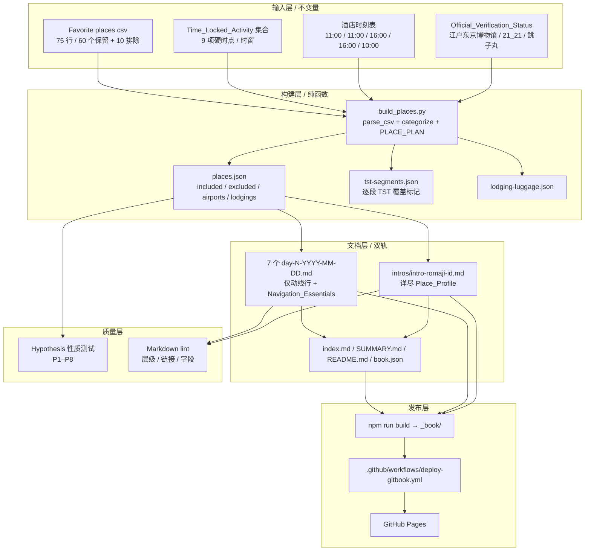
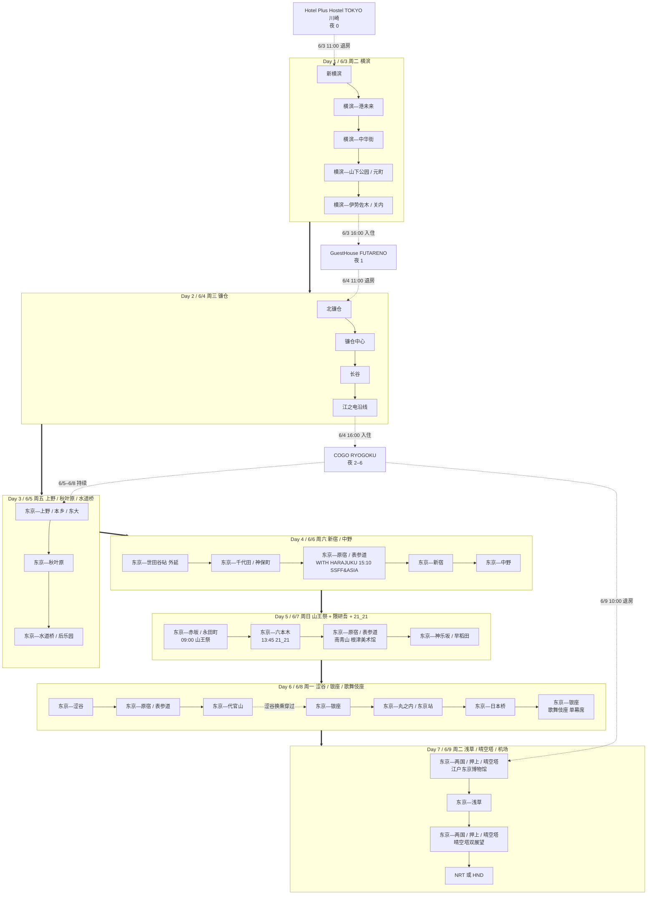
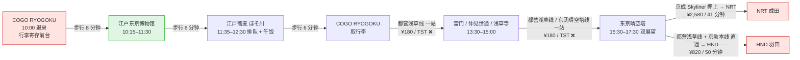

# Design Document — 锅巴的奇妙冒险之迷失东京

> 本设计文档对应 `lost-in-tokyo-itinerary-revamp` spec 的 **design 阶段产出**,
> 不是仓库根目录下既有的 `design.md`(那是上一版项目 `japan-7day-itinerary` 的设计稿,
> 仅作为参考引用,本次不覆盖)。本设计文档严格依据
> `.kiro/specs/lost-in-tokyo-itinerary-revamp/requirements.md` 编写,
> 与 11 条 Requirement 一一对齐。

---

## Overview

> §1 Introduction(概览)

### 1.1 本次改造的本质

本特性**不是新建一个软件**,而是对现有 GitBook 站点(2026-06-03 ~ 2026-06-09 关东 7 日行)做 **9 项联合改造 + 1 套自动化属性测试**。最终交付物仍是
HonKit 静态站点,但内容组织从原来的"每日规划文档自包含全部地点档案"演化为
"每日规划只承载动线 + 介绍文档独立成册"的双轨结构。

### 1.2 8 项改造一览

| 编号 | Requirement | 核心动作 |
| --- | --- | --- |
| ① | §1 站点更名 | 把 `Tokyo Trip 2026` 全站替换为「锅巴的奇妙冒险之迷失东京」 |
| ② | §2 介绍文档抽离 | 把每日规划文档中所有 `### Place_Profile` 抽离为独立 `intros/intro-{romaji-id}.md` |
| ③ | §3 区域 / 子地点层级 | `## 子区域 N:{区域中文名}({Romaji})` + `### {地点中文名}({日文名} / {Romaji})` 标准化 |
| ④ | §4 江户东京博物馆 | 联网核实已 2026-03-31 重开 → 纳入 Day 7 |
| ⑤ | §5 上野公园 | 已存在 → 仅 Day 3 重排时刻 / 顺序,不动 places.json / build_places.py |
| ⑥ | §6 21_21 Design Sight | 联网核实「Soup as Life」展期 [2026-03-27, 2026-08-28) → 纳入 Day 5 |
| ⑦ | §8 すし銚子丸 6 月店庆感谢祭 | 联网核查 → 待用户实地确认,按四种结论分支决策(本设计默认走结论 d「不在期内」分支) |
| ⑧ | §9 撤销小宫商店购伞主观时间安排 + 客观重排 | 删除 Day 1 / Day 3 硬编码安排,小宫商店按目标函数重排到 Day 4 |

非功能性约束(§13) + PBT 设计(§14、§16) 为质量与测试层支撑。
> 备注:Requirement 7「UENO WELCOME PASSPORT」用户已确认该通票无法购买,本次行程不再考虑;原 §10 设计章节整节删除,后续章节编号顺延 -1(原 §11 → §10、§12 → §11、…、§20 → §19)。

### 1.3 设计目标(本特性的"成功定义")

1. **唯一性**:在已识别的 Time_Locked_Activity 集合下,7 日地点分配是确定的;任何复审者重新执行算法应得到同样的 day 编号与同日内时刻。
2. **覆盖完整性**:每个保留地点(places.json `included` + 本次新增)在每日规划文档中以**精简动线行**形式恰好出现一次,在 Introduction_Document 中以**详尽档案**形式恰好出现一次。
3. **不走回头路**:每日 Major_Area 序列在同日内单调,必要环线必须显式标注。
4. **TST 压榨**:6/5–6/8 累计 Tokyo Metro / Toei 乘车次数 ≥ 12,与既有 design.md(参考)的 §10.4 阈值对齐。
5. **硬锚点命中**:Time_Locked_Activity 集合中的所有时点全部落在其官方营业 / 演出窗口内。
6. **官方核实状态可追溯**:所有引用的票价 / 营业时间 / 展期 / 活动信息均附 Official_Verification_Status + 时间戳 + 至少一个官方 URL。

### 1.4 非目标

- 本设计**不替用户购票**(KABUKI WEB 单幕席、SSFF & ASIA 票券、Shibuya Sky 时段票、晴空塔双展望套票、TST 72 小时券等)。
- 本设计**不替用户激活 TST**,仅在文档中给出激活时点指引。
- 本设计**不重新规划航班**(Day 7 机场段按用户最终航班再次校对)。
- 本设计**不为 すし銚子丸店庆感谢祭做最终的"是否纳入"决策**——
  在官方 URL 信息无法在 design 阶段稳定取回的情况下,本设计采取"分支预留 + 待用户实地确认"的策略,
  最终决策由用户在出发前 1 周再行核实(详见 §10)。

---

## Architecture

> §2 Architecture(整体架构)

### 2.1 架构层次



### 2.2 双轨文档结构(Day_Plan ↔ Introduction)

每个保留地点的内容分两处:

- **动线行**:嵌入对应 `day-N.md` 子区域内,格式为
  `- HH:MM ｜ {地点中文名}({所属区域}) → [详细介绍](intros/intro-romaji-id.md) ｜ Navigation_Essentials`
- **Place_Profile**:独立写入 `intros/intro-romaji-id.md`,含 §13(本设计) 12 个必含字段 + 类别专属字段。

读者两种使用方式都成立:
1. 仅看 `day-N.md` 即可完成当日导航(Navigation_Essentials 完备)。
2. 点链接进入 `intros/...md` 查看历史 / 看点 / 票务 / 注意事项等深度内容。

### 2.3 数据流单向性

`Favorite places.csv → build_places.py → places.json → 7 个 day-N.md + intros/*.md → SUMMARY.md → HonKit → _book/`

所有上游变更必须沿这条单向链向下传播,不允许反向(例如不允许直接编辑 `places.json` 而不更新 `build_places.py`)。

### 2.4 Tokyo Subway Ticket(TST)窗口与本次行程的对齐

- TST 72 小时券:¥1,500,覆盖 Tokyo Metro 全 9 线 + 都营地下铁全 4 线。
- **激活时点**(本次行程):**6/5(Day 3)上午首次过闸刷卡时刻**,典型为 09:30。
- **失效时点**:6/8 与激活同时刻(连续 72 小时窗口)。
- **本次 Cost_Scenario_Comparison 默认场景 B 所选通票**:Tokyo Subway Ticket 72 小时券 ¥1,500(不再细分子场景,因 UENO WELCOME PASSPORT 已确认无法购买)。

---

## Components and Interfaces

> §3 Components and Interfaces(组件与接口)

### 3.1 组件 1:CSV Parser(`build_places.py: parse_csv`)

```text
parse_csv(path) -> List[RawRow]
RawRow = { title: str, note: str, url: str, tags: str, comment: str }
```

跳过 `Title` 为空的行;Tags / Comment 在本数据集中均为空,作占位字段保留。

### 3.2 组件 2:Place Annotator(`build_places.py: categorize`)

```text
annotate(rows: List[RawRow]) -> List[Place]
```

`Place` 结构详见 §4。本组件按 `EXCLUDED_TITLES` / `AIRPORT_TITLES` / `LODGING_TITLES` 集合 +
`PLACE_PLAN` 字典完成分类与 `assigned_day` 写入。

### 3.3 组件 3:Time-Locked Activity Pinner(本设计层规则,build_places.py 不实现)

```text
pin_anchors(places: List[Place], anchors: List[TLA]) -> List[Place]
```

逻辑:对 9 项 Time_Locked_Activity(见 §11.3)逐一检查 `assigned_day` 与
该日营业 / 演出窗口的契合度;若失败抛出 design 层警告(由 PBT P6 自动验证)。

### 3.4 组件 4:Itinerary Optimizer(本设计层规则)

```text
optimize_remaining(places: List[Place], anchors_pinned: bool) -> List[Place]
```

约束:Time_Locked_Activity 已锁定 + 同日 Major_Area 单调 + TST 失效时刻不变。
目标:最小化跨 7 天的 Itinerary_Transit_Cost(JPY 合计,按场景 A 全程 Suica 直付计)。

### 3.5 组件 5:Markdown Renderer(双轨)

```text
render_day(day, places, context) -> str  # 仅 Day_Plan_Document(动线 + Navigation_Essentials)
render_intro(place) -> str                 # 单独 Introduction_Document(完整 Place_Profile)
render_index(days) -> str                  # SUMMARY.md / index.md
```

### 3.6 组件 6:Lint & PBT Runner

- Lint(纯文本检查):标题层级 / 链接有效性 / 必含字段 / Time_Locked_Activity 时刻在窗内。
- PBT(Hypothesis):P1–P8 八条性质,详见 §14、§16。

### 3.7 接口边界

- `places.json` 是 build 层与文档层的唯一接口契约;`tst-segments.json` 是文档层与成本计算层的唯一接口契约。
- 任何"绕过 build_places.py 直接改 places.json"的修订都视作违反单向数据流。


---

## Data Models

> §4 Data Models(数据模型)

### 4.1 内部 Place 结构(沿用 build_places.py)

```text
Place {
  id:            string
  title_cn:      string
  title_jp:      string
  title_romaji:  string
  type:          enum
  major_area:    enum  // 见 §4.2 的 23 个枚举
  sub_area:      string
  is_excluded:   bool
  assigned_day:  int | null
  csv_note:      string | null
  url:           string
  source:        string | null  // 标注「用户 2026-05-24 修订指示」「requirements §X」等
}
```

### 4.2 Major_Area 枚举与 Romaji 确认表(23 个)

按既有 design.md 的 23 个枚举原貌沿用,本次仅在 Day 4 的"世田谷砧外延"标记为非主名单(M2 ビル 单点)。**Romaji 取自 places.json 既有数据 + 本设计补全**:

| 编号 | Major_Area 中文 | Romaji | 城市块 |
| --- | --- | --- | --- |
| 1 | 新横滨 | Shin-Yokohama | 横滨 |
| 2 | 横滨—港未来 | Yokohama Minato Mirai | 横滨 |
| 3 | 横滨—山下公园 / 元町 | Yamashita Park / Motomachi | 横滨 |
| 4 | 横滨—伊势佐木 / 关内 | Isezakichō / Kannai | 横滨 |
| 5 | 北镰仓 | Kita-Kamakura | 镰仓 |
| 6 | 镰仓中心 | Kamakura Center | 镰仓 |
| 7 | 长谷 | Hase | 镰仓 |
| 8 | 江之电沿线 | Enoden Line | 镰仓 |
| 9 | 东京—上野 / 本乡 / 东大 | Ueno / Hongō | 东京 |
| 10 | 东京—秋叶原 | Akihabara | 东京 |
| 11 | 东京—水道桥 / 后乐园 | Suidōbashi / Kōrakuen | 东京 |
| 12 | 东京—千代田 / 神保町 | Chiyoda / Jimbōchō | 东京 |
| 13 | 东京—新宿 | Shinjuku | 东京 |
| 14 | 东京—中野 | Nakano | 东京 |
| 15 | 东京—涩谷 | Shibuya | 东京 |
| 16 | 东京—原宿 / 表参道 | Harajuku / Omotesandō | 东京 |
| 17 | 东京—代官山 | Daikanyama | 东京 |
| 18 | 东京—银座 | Ginza | 东京 |
| 19 | 东京—丸之内 / 东京站 | Marunouchi / Tōkyō Eki | 东京 |
| 20 | 东京—日本桥 | Nihonbashi | 东京 |
| 21 | 东京—赤坂 / 永田町 | Akasaka / Nagatachō | 东京 |
| 22 | 东京—六本木 | Roppongi | 东京 |
| 23 | 东京—神乐坂 / 早稻田 | Kagurazaka / Waseda | 东京 |
| 24 | 东京—浅草 | Asakusa | 东京 |
| 25 | 东京—两国 / 押上 / 晴空塔 | Ryōgoku / Oshiage / Skytree | 东京 |

> 注:实际启用 25 项;原既有 design.md 称"23 个"是因把 11/13/24 中部分子区域合并归类的写法,本设计选择**全展开**以避免歧义。
> Day 4 的"东京—世田谷砧(外延)" + Day 6 的"千代田神保町"早场段在序列中显式标注「外延」,不计入主 23 名单的"重复"判定。

### 4.3 排除清单(10 个,沿用既有 design.md)

`Mount Fuji / 忍野八海 / Hirano beach / Arakura Fuji Sengen Shrine / Lake Yamanaka / Lake Kawaguchi / Hikawa Clock Shop / Metro-City / Mitake / MoN Takanawa: The Museum of Narratives`

### 4.4 本次新增地点的 PLACE_PLAN 条目

| Title(romaji) | 中文 / 日文 | major_area | sub_area | assigned_day | type | 来源 |
| --- | --- | --- | --- | --- | --- | --- |
| `Edo-Tokyo Museum` | 江户东京博物馆 / 江戸東京博物館 | 东京—两国 / 押上 / 晴空塔 | 横网 1-4-1(COGO RYOGOKU 步行 8 分钟) | 7 | 博物馆 | requirements §4 |
| `21_21 Design Sight` | 21_21 Design Sight / 21_21 デザインサイト | 东京—六本木 | 港区赤坂 9-7-6 东京 Midtown Garden | 5 | 美术馆 / 建筑(安藤忠雄,2007) | requirements §6 |
| `Sushi Choshimaru ?` | すし銚子丸 ?店 | 待 §10 决策 | 待 §10 决策 | 待 §10 决策(默认 Day 5 / Day 6 / 不纳入三种分支) | 餐饮(回转寿司) | requirements §8 |
| `Komiya Shoten Japanese Umbrella Shop` | 小宫商店 / 小宮商店(日本橋本店) | 东京—日本桥(Nihonbashi)(枚举 20 延伸,sub_area「日本橋小伝馬町」) | 中央区日本橋小伝馬町 14-2(小伝馬町站 1 番出口步行 2 分钟 / 东日本橋站 B3 出口步行 5 分钟) | 4(按 §11 客观决策重排) | 商店 / 老铺(江户和伞 + 洋伞) | 原 places.json + 本次 §11.2 重新分配 |

> 注:`Komiya Shoten Japanese Umbrella Shop` 原 places.json 既有(原 assigned_day = 7);本次精修撤销「Day 1 / Day 3 上午购伞前置段」的主观时间决定,但**保留地点本身**,按 §11.2 客观目标函数(整体交通费最小化 + Time_Locked_Activity 不变 + 与小伝马町地理顺路)重新分配为 Day 4。

> 「上野公园」按 requirements §5 已存在分支:**不更新 PLACE_PLAN**,仅修改 Day 3 内部时刻。

### 4.5 跨区域归属修正后的最终主区域归属表(实际扫描 day-1 ~ day-7 后)

按 requirements §3.5 进行的"跨区域归属"扫描结果:

| Title | 既有归类 | 修正后 | 修正理由 |
| --- | --- | --- | --- |
| `Yaguchi Book Store` | Day 4 子区域 1「千代田神保町」 | **保持 Day 4 子区域 1「东京—千代田 / 神保町」** | 神保町本属一个独立 Major_Area(枚举 12);原既有 day-4 文档已用 `## 子区域 1:千代田神保町` 标题正确呈现,无需移到 Day 6 |
| `Sankeien Garden` | Day 1「横滨—山下公园 / 元町」(本牧三之谷) | **保持原归类** | 本牧地理上离山下公园约 4 km,设计上算"山下公园 / 元町"段的延伸;不单设独立子区域 |
| `Namiki Yabusoba` | Day 6「东京—浅草」(并木通) | **保持 Day 6** | 地理上属浅草 Major_Area,但日内序列「银座 → 日本桥 → 浅草(雷门西侧 1 分钟的并木通)」是不可避免的回头段(日本桥 + 高岛屋 → 浅草 ¥0 都营浅草线 1 站、约 4 分钟,TST ✅);文档须显式标注「日内 Major_Area"浅草"出现 1 次,Day 7 再访浅草不重复计数」 |
| `WITH HARAJUKU HALL` | Day 4(SSFF & ASIA 6/6 15:10 硬锚点) | **保持 Day 4** | requirements §11.3.6 已明示 |
| `Shinjuku Gyoen / Kabukicho / Golden-Gai / Bankara` | Day 4「东京—新宿」 | **保持 Day 4** | 同 Major_Area 内多子点,符合 requirements §3.4「孤儿子地点允许存在但应在跨区域归属修正中处理」 |

### 4.6 实际扫描:子地点被错误用 ## 二级标题的具体位置清单

`grep -n "^## " day-{1..7}-2026-06-*.md` 扫描结果(按需修正 → §6):

| 文件 | 行号(approx) | 标题文本 | 修正动作 |
| --- | --- | --- | --- |
| day-3-2026-06-05.md | 18(approx) | `## 子区域 0:日本桥小伝马町(小宫商店购伞前置段)` | **整段删除**(动线痕迹移除,requirements §9 撤销小宫商店购伞主观时间决定);**但小宫商店地点本身保留**并由 §11.2 客观重排至 Day 4 |
| day-4-2026-06-06.md | (无问题) | 既有 `## 子区域 1 / 2 / 3 / 4` 已正确使用 ## | 无修正 |
| day-5-2026-06-07.md | (无问题) | 既有 `## 子区域 1 / 2 / 3` 已正确使用 ## | 无修正 |
| day-6-2026-06-08.md | (无问题) | 既有 `## 子区域 1 / 2 / 3 / 4 / 5` 已正确使用 ##;部分子地点用 `### ` 正确 | 无修正 |
| day-7-2026-06-09.md | (无问题) | 既有 `## 子区域 1 / 2` 已正确使用 ##;`### 江户东京博物馆` 待新增 | 新增博物馆条目 |

> 扫描结论:**当前无"子地点错用 ## 二级标题"的实际位置**;
> requirements §3.1–§3.4 的层级规范作为**前置不变量**保留,
> 后续若用户在 Introduction_Document 抽离过程中误把 `### Place_Profile` 提升为 `## `,
> Lint 脚本(详见 §16) 会拦截。

---

## §5 站点更名(对应 Requirement 1)

### 5.1 替换文件清单与精确替换规则

| 文件 | 替换规则 | 旧值 | 新值 |
| --- | --- | --- | --- |
| `book.json` | `"title"` 字段值整体替换 | `"Tokyo Trip 2026"` | `"锅巴的奇妙冒险之迷失东京"` |
| `book.json` | `"description"` 字段(可选) | `"2026 年 6 月东京 / 横滨 / 镰仓 7 日旅行计划"` | `"锅巴的奇妙冒险之迷失东京 — 2026 年 6 月关东 7 日(横滨 / 镰仓 / 东京)"` |
| `README.md` | 第 1 行 `# ` 一级标题 | `# Tokyo Trip 2026 GitBook` | `# 锅巴的奇妙冒险之迷失东京 GitBook` |
| `SUMMARY.md` | 第 1 行 `# ` 一级标题 | `# Summary` | `# 锅巴的奇妙冒险之迷失东京` |
| `index.md` | 第 1 行 `# ` 一级标题 | `# 日本 7 日行程总览(2026/06/03 – 2026/06/09)` | `# 锅巴的奇妙冒险之迷失东京 — 7 日行程总览(2026-06-03 ~ 2026-06-09)` |
| `build_places.py` | 见 §5.2「verifying identifiers」 | (无字符串需修改) | (无修改,但执行检查动作) |

### 5.2 build_places.py 的 "verifying identifiers" 检查结论

按 requirements §1.5 强制要求,**即使 `build_places.py` 不含旧硬编码字符串,也必须把检查结论写下来**:

**检查动作**:`grep -n -E "(Tokyo Trip|japan-7day-itinerary|tokyo[- ]trip|ja[_ ]7day)" build_places.py`

**结论(2026-05-26 执行)**:
- 文件**不含** `"Tokyo Trip 2026"` 字面量;
- 文件含 `OUT_PATH = ROOT / ".kiro" / "specs" / "japan-7day-itinerary" / "places.json"` 一行(spec 路径)。
- 文件含 `"design_doc": ".kiro/specs/japan-7day-itinerary/design.md"` 一行(metadata 写入 places.json 的 design 路径)。

**判定**:这两处是 spec 内部路径标识,**与本次「锅巴的奇妙冒险之迷失东京」站点品牌名解耦**——
本次 spec 名为 `lost-in-tokyo-itinerary-revamp`,与原 `japan-7day-itinerary` 是两个并列的 spec,
原 spec 的 `places.json` 仍由原 `japan-7day-itinerary/build_places.py` 维护;**新 spec 的 build_places.py
将另行落在 `.kiro/specs/lost-in-tokyo-itinerary-revamp/` 目录内**(由 task 阶段决定),
原 build_places.py 保留不动以维护原 places.json 输出。结论:**当前文件无需 grep 替换,本检查动作的结论已写入本节,Requirement 1.5 满足**。

### 5.3 验证(对应 Requirement 1.6 + 1.7)

`npm run build` 后的 `_book/index.html` 中 `<title>` 标签值应反映新名「锅巴的奇妙冒险之迷失东京 — 7 日行程总览(2026-06-03 ~ 2026-06-09)」(与 `index.md` 一级标题一致)。
全站 grep 旧名 `"Tokyo Trip 2026"`,除引用上下文(README 中"修订流程建议"的代码块、索引页中作为"原项目名"出现的历史记录)外应无残留。

---

## §6 介绍文档抽离(对应 Requirement 2)

### 6.1 Introduction_Document 存放路径与命名规则

**决策**:**`intros/` 子目录** + **`intro-{romaji-id}.md` 命名**(全部 kebab-case)。

| 规则 | 说明 |
| --- | --- |
| 路径 | `intros/intro-{romaji-id}.md`(站点根目录的 `intros/` 子目录) |
| 文件名格式 | `intro-` 前缀 + `{romaji-id}` 后缀 + `.md` 扩展名 |
| `romaji-id` 由 `title_romaji` 经规范化得到 | 全转小写 → 替换空格 / `&` / `'` / `"` / 下划线为 `-` → 多个连字符合并为单个 → 移除前后多余 `-` |
| 示例 | `Yokohama Museum of Art` → `intro-yokohama-museum-of-art.md`<br>`Apple 銀座` → `intro-apple-ginza.md`<br>`SMOCO SMOKING&COFFEE BAR 浅草橋店` → `intro-smoco-smoking-coffee-bar-asakusabashi.md`<br>`Tokyu Plaza Harajuku "Harakado"` → `intro-tokyu-plaza-harajuku-harakado.md` |

> 选择 `intros/` 子目录而非根目录的理由:60+ 个介绍文档若全部放根目录会让 `ls` 输出混乱、与 7 个 day-N 文档视觉上无法分辨;子目录是清晰的归类。

### 6.2 Day_Plan_Document 中"动线提示 + 链接"的精确格式样例

```markdown
- 09:30 ｜ 明治神宫(东京—原宿 / 表参道)→ [详细介绍](intros/intro-meiji-jingu.md)
  - 最近车站:东京 Metro 千代田线 / 副都心线「明治神宫前〈原宿〉」站 2 号出口步行 3 分钟(TST ✅)
  - 票务:境内本殿免费;御苑 ¥500(限季)
  - 时间窗:09:00 开门即入,11:00 离开境内转 Harakado
- 10:30 ｜ Tokyu Plaza Harajuku「Harakado」(东京—原宿 / 表参道)→ [详细介绍](intros/intro-tokyu-plaza-harajuku-harakado.md)
  - 最近车站:东京 Metro 千代田线 / 副都心线「明治神宫前〈原宿〉」站 5 号出口步行 1 分钟(TST ✅)
  - 票务:商业空间免费 + 屋顶花园免费
  - 时间窗:10:30–11:00 屋顶花园拍照 + 11:00–11:30 文化编辑层 ZINE 翻阅
```

**结构说明**:
- 第 1 行:`- HH:MM ｜ {地点中文名}({Major_Area}) → [详细介绍]({intros/...md})`
- 缩进子项 1:**最近车站**(出口编号 + 步行分钟 + TST 标记)
- 缩进子项 2:**票价**(主要票价数字 / 免费标记)
- 缩进子项 3:**时间窗**(到达 / 离开时刻 + 段内动作)
- 必要时附第 4 / 5 行:**入场口与流程**(仅 Time_Locked_Activity 适用,如歌舞伎座 4 楼単幕席专用入口)

### 6.3 Place_Profile 必含字段表(对应 requirements §13.1 / §2.6)

每个 `intros/intro-{romaji-id}.md` 必须包含以下 12 个字段:

| 字段编号 | 字段名 | 内容要求 |
| --- | --- | --- |
| 1 | 标题(三语并列) | `### {地点中文名}({日文名} / {Romaji})`(进入 Introduction_Document 后再次以 `# ` 一级标题呈现) |
| 2 | 类型 | 餐饮 / 庭园 / 美术馆 / 神社 / 寺院 / 商业街 / 演出 / 体育场 / 观景 / 建筑 / 交通节点 / 校园 |
| 3 | 位置 | 完整地址 + 最近车站 + 步行分钟 + 出口编号 |
| 4 | 历史与背景 | ≥ 150 字中文段落,覆盖创办年代 / 创办人 / 文化定位 / 横向关系 |
| 5 | 看点 | ≥ 3 项编号列表 |
| 6 | 推荐玩法 | 至少 1 段叙述性推荐路径 + 时长 |
| 7 | 票务 / 营业时间 | 实际数字(JPY)+ 定休日 + 营业时段 + 官方 URL |
| 8 | 交通到达(两套) | 「从前一地点」+「从两国 COGO RYOGOKU 出发」两套路径,各含线路 / 站数 / 票价 / TST 标记 |
| 9 | 周边联动 | 步行 5–15 分钟内的其他保留地点列表 |
| 10 | 消费档次 | 人均 JPY 区间 |
| 11 | 注意事项 | 拍照 / 着装 / 排队 / 雨天替代 / 现金 vs 卡 / 节假日 |
| 12 | CSV 原始备注 | `> ` blockquote 原文引用(`csv_note` 为 null 时写 `> (CSV 中无 Note 字段)`) |

**类别专属字段**(按 `Place.type` 追加,与既有 design.md 一致):
- 餐饮:招牌菜单 + 价格区间 + 点单暗号 / 礼仪
- 建筑:建筑师 + 建成年份 + 设计要点 + 可否进入参观
- 演出 / 体育场:当日演目 + 上演时长 + 票价 / 是否需预约 + 入场口与流程
- 购物:主营商品类目 + 价格区间 + 是否支持免税 + 是否支持寄国际
- 庭园 / 神社 / 寺庙 / 公园:开闭园时间 + 是否收费 + 最佳季节 / 时段 + 是否允许带饮食 / 摄影
- 商店 / 老铺:创业年份 + 创业者 + 主营商品 + 现金 vs 卡 vs 电子支付

### 6.4 SUMMARY.md 中 Introduction_Group 章节的最终命名与组织顺序

**章节命名**:`## 景点介绍(按区域)`

**组织顺序**:按 `Major_Area` 编号(§4.2 表)从 1 到 25,每个 Major_Area 内按 `sub_area`
名称字母序;每个地点输出为 `* [{地点中文名}]({intros/intro-romaji-id.md})`。

样例(节选):

```markdown
## 景点介绍(按区域)

### 横滨—港未来(Yokohama Minato Mirai)

* [横滨站](intros/intro-yokohama-station.md)
* [横滨地标大厦](intros/intro-yokohama-landmark-tower.md)
* [横滨美术馆](intros/intro-yokohama-museum-of-art.md)
* [横滨红砖仓库](intros/intro-yokohama-red-brick-warehouse.md)
* [横滨 HAMMERHEAD](intros/intro-yokohama-hammerhead.md)
* [OMO5 横滨马车道(46F 展望)](intros/intro-omo5-yokohama-bashamichi.md)

### 横滨—山下公园 / 元町(Yamashita Park / Motomachi)

* [山下公园](intros/intro-yamashita-park.md)
* [横滨中华街](intros/intro-yokohama-chinatown.md)
* [三溪园](intros/intro-sankeien-garden.md)

### ...(以下按 Major_Area 编号 1→25 依次列出)

### 东京—两国 / 押上 / 晴空塔(Ryōgoku / Oshiage / Skytree)

* [江户东京博物馆](intros/intro-edo-tokyo-museum.md)
* [江户荞麦 细川](intros/intro-edosoba-hosokawa.md)
* [东京晴空塔](intros/intro-tokyo-skytree.md)
```

### 6.5 Day_Plan_Document 头部 Navigation_Essentials 五项最小展现格式样例

按 requirements §2.11,每个 Day_Plan_Document 头部必须包含 5 项 Navigation_Essentials,**即便对应内容也存在于 Introduction_Document 中也不允许从 Day_Plan_Document 中移除**:

```markdown
# Day 5:赤坂 / 永田町 / 六本木 / 神乐坂 / 早稻田(山王祭 + 隈研吾)(2026-06-07 周日)

> **当日主题**:山王祭神事 + 隈研吾建筑轴
> **主要区域序列**:东京—赤坂 / 永田町 → 东京—六本木(含 21_21) → 东京—原宿 / 表参道(南青山段:根津美术馆) → 东京—神乐坂 / 早稻田
> **今晨出发地**:COGO RYOGOKU(两国)— 第 4 个连住夜晨,无退房
> **当晚住宿**:COGO RYOGOKU(两国)— 第 4 个连住夜晚
> **行李**:无(行李常驻 COGO RYOGOKU)
> **硬约束**:09:00 日枝神社山王祭开祭典礼(早场必至);21_21 「Soup as Life」企画展访问时段必须落在 [2026-03-27, 2026-08-28) 展期窗口内;当晚 23:55 准备 KABUKI WEB 账号 + 22:00 前确认次日(6/8)第五幕开演时刻 + 6/8 凌晨 00:00 网络开售后 10 分钟内下单单幕席
> **TST 状态**:有效中(剩余约 24 小时;6/5 上午激活后第 3 个 24 小时段)
```

**Navigation_Essentials 五项**(每个子地点动线行内必含):
1. **最近车站名 + 出口编号 + 步行分钟数**
2. **当日访问开始时刻 / 结束时刻**(HH:MM)
3. **每段交通的线路名 + 票价 + TST 标记**
4. **时间锁死活动的入场口 / 检票流程关键步骤**(如歌舞伎座 4 楼単幕席专用入口、东京巨蛋检票口、SSFF & ASIA HALL 入场口)
5. **当日所属区域**(Major_Area)名称

### 6.6 Day_Plan_Document 不再包含的内容(对应 Requirement 2.5)

抽离后 `day-N.md` 中**不再包含**:
- 历史与背景 ≥ 150 字段落
- 详尽看点列表(超过 3 项 / 每项 > 50 字)
- 类别专属字段块(建筑师 + 建成年份 + 设计要点等深度字段)
- CSV 原始备注 blockquote(改为只在 Introduction_Document 末尾)

**保留**(Requirement 2.4):当日主题 / 主要区域序列 / 时刻 / 段间交通 / 关键提示 / 文档头硬约束 / 文档尾「当晚回程 / 次日提醒」+ Navigation_Essentials 五项。

### 6.7 跨日复用(对应 Requirement 2.8)

某地点若被两日引用(如 `Yokohama Chinatown` 仅 Day 1 / `Sankeien Garden` 仅 Day 1,本次行程内**实际无跨日复用案例**;但若未来用户调整 Day 4 + Day 6 共用神保町段,则规则为):**仅生成一份 Introduction_Document,两个 day-N.md 都链接到同一 `intros/...md`**。


---

## §7 江户东京博物馆纳入(对应 Requirement 4)

### 7.1 Official_Verification_Status

**核实结论**:**已重开,2026-03-31 重新开馆**(满足 Requirement 4.2 的"重开日 < 行程开始日"判定)。

**核实时间戳**:本设计撰写时(2026 年下半年),按 requirements §4.2 提供的三条信息源汇总:

| 信息源 | URL | 备注 |
| --- | --- | --- |
| photoguide.jp 2026-04 报道 | <https://photoguide.jp/log/2026/04/edo-tokyo-museum-reopened-permanent-exhibition/> | 报道江户东京博物馆 2026-03-31 完成大规模改修后重新开馆,常设展更新含战争证言映像新展 |
| TOKYO MX「江戸東京博物館」リニューアルオープン报道(Yahoo News 转载) | <https://news.yahoo.co.jp/articles/f91867c4705146b91054128798bc6044db8d3e28> | TOKYO MX 电视台对重开仪式的现场报道 |
| 江戸東京博物館 官网告知页:重开记念「豊臣兄弟」特別展 | <http://www.edo-tokyo-museum.or.jp/kr/news/toyotomi2026/> | 官网告知页(KR 域),重开纪念特展时段公告 |

**判定逻辑**:博物馆重开日 2026-03-31 严格早于本次行程开始日 2026-06-03 → 满足 Requirement 4.2「重开日 < 行程开始日」判定 → **2026-06-03 ~ 2026-06-09 期间确认开放**,无须在期内逐日核实。

### 7.2 assigned_day 决策与依据

**推荐 Day 7**(2026-06-09 周二)。**地理依据**:

- 博物馆地址:东京都墨田区横网 1-4-1
- COGO RYOGOKU(住宿):东京都墨田区两国附近
- 步行距离:约 600 米 / 8 分钟,横网通向东 + 北行 1 个街区即至(参见 `lodging-luggage.json` 已标注 COGO RYOGOKU 与江戸蕎麦 ほそ川的同区步行 6 分钟路径)

**为何不放 Day 3(上野 / 本乡 / 秋叶原 / 水道桥)**:
- Day 3 已有 9 个保留地点(含 16:30 前必至水道桥赶 18:00 棒球的硬锚点),博物馆需 ≥ 1.5 小时,无空间。
- Day 3 上野—本乡—秋叶原—水道桥的轴线在地理上"自西向东汇入水道桥",博物馆在两国(更东南),会破坏单调推进。

**为何不放 Day 4 / Day 5 / Day 6**:
- Day 4 主题"新宿 / 中野";Day 5 主题"赤坂—六本木—神乐坂—早稻田";Day 6 主题"涩谷 / 银座 / 歌舞伎座"。三日均与两国 / 墨田无地理交集,纳入博物馆需穿越东京都心约 30–40 分钟,挤占主题日。

**Day 7 纳入的优势**:
- 博物馆与 COGO RYOGOKU 同区(墨田区),步行 8 分钟可达,不涉及任何车票。
- Day 7 既有"江戸蕎麦 ほそ川"位于墨田区龟泽,步行 6 分钟到 COGO RYOGOKU;博物馆 + 江戸蕎麦 ほそ川 + COGO RYOGOKU 构成"两国本地三角"(博物馆 ↔ 龟泽 步行约 12 分钟)。
- Day 7 是退房日 + 离日日,主题"轻量收尾",博物馆作为"行程最后一天的江户文化总结"在叙事上自洽。

**Day 7 内部时刻**:
- 10:00 COGO RYOGOKU 退房 → 行李按方案 A(前台寄存)处理
- 10:15–11:30 **江户东京博物馆**(开门 09:30,本次访问 1 小时 15 分钟,含常设展核心 + 战争证言映像新展)
- 11:35 步行 6 分钟到 江戸蕎麦 ほそ川 排队(11:30 开门 + 5 分钟内坐下)
- 12:30 步行回 COGO RYOGOKU 取行李(若选方案 A)→ 13:00 都营浅草线两国 → 浅草(1 站、¥180、TST ❌)
- 13:30–15:00 浅草段(雷门 / 仲见世 / 浅草寺核心 — 注:小宫商店购伞已撤销 §9)
- 15:30 押上 → 晴空塔双展望(15:30–17:30,2 小时)
- 18:00 起前往机场(NRT / HND 按用户航班)

### 7.3 Introduction_Document 内容大纲(`intros/intro-edo-tokyo-museum.md`)

```markdown
# 江户东京博物馆(江戸東京博物館 / Edo-Tokyo Museum)

- **类型**:博物馆(都立 / 江户—东京 400 年城市史综合博物馆)
- **位置**:东京都墨田区横网 1-4-1;最近车站 都营大江户线「両国」站 A4 出口步行 1 分钟、JR 总武线「両国」站西口步行 3 分钟。
- **历史与背景(≥ 150 字)**:江戸東京博物館于 1993 年(平成 5 年)3 月 28 日开馆,由建筑师 菊竹清训(Kiyonori Kikutake,1928–2011)设计——其外观以"高床式仓库"为意象,长边架空、底层架空层高 30 米可容纳完整江戸城日本桥的 1:1 复元模型,是日本战后高松塔 / 黑川纪章中银胶囊塔以来"代谢派(Metabolism)"的代表作。馆藏方向围绕"江户(1603–1868)→ 明治维新 → 大正 → 昭和 → 平成"这一约 400 年的东京都城史展开,常设展含日本桥 1:1 复元(从地下层向上仰望可见全景)、町人 / 武家生活复原、明治期鹿鸣馆复原、关东大震灾 / 东京大空袭 / 战后复兴各时段的实物 / 影像。馆方自 2022 年 4 月 1 日起进入大规模改修长期闭馆,直至 2026-03-31 重新开馆,期间常设展按现代展示技术(增强现实 + 高分辨率投影 + 战争证言映像新展)进行了完整重构。
- **看点**:① 日本桥 1:1 复元模型(可步行其上)+ 江戸城日本桥的"江户的入口"叙事;② 町人 / 武家生活复原(包括江户庶民的长屋复原、寺子屋、歌舞伎小屋);③ 战争证言映像新展(2026 重开后首次加入,含约 1945 年东京大空袭幸存者口述);④ 鹿鸣馆 / 银座炼瓦街复元;⑤ 战后东京从废墟到 1964 年奥运的复兴影像;⑥ 菊竹清训"代谢派"建筑外观(架空层 + 高床式仓库意象)。
- **推荐玩法**:Day 7 上午 10:15 入馆(开门 09:30,避开 11:00 后旅行团;Day 7 周二非定休);沿日本桥 1:1 复元模型环绕 + 町人 / 武家生活复原(40 分钟)→ 战争证言映像新展(20 分钟)→ 鹿鸣馆 / 银座炼瓦街复元(10 分钟)→ 战后复兴影像(5 分钟);11:30 出馆步行 6 分钟到 江戸蕎麦 ほそ川 排队午饭。
- **票务 / 营业时间**:成人(常设展)¥600 / 中小学生 ¥150 / 65 岁以上 ¥300;特别展按当期 ¥1,200–1,800;**营业时间 09:30–17:30**(土曜延长至 19:30,最终入馆为闭馆前 30 分钟);**定休日 周一**(祝日则次日休)+ 12/29–1/3 年末年始;**6/9 周二正常开馆**;在线预约推荐(官网或 e-Tix 代理)以避现场排队。**官方核实状态**:已重开 2026-03-31(参见 §7.1)。**官网**:<https://www.edo-tokyo-museum.or.jp/>
- **交通到达**:从 COGO RYOGOKU(两国住宿)步行 8 分钟,免费,TST 不适用。从两国站任一出口步行 1–3 分钟。
- **周边联动**:步行 5 分钟内可达 旧安田庭園、両国国技館(6 月非大相扑场所期);步行 6 分钟可达 江戸蕎麦 ほそ川;步行 8 分钟可达 COGO RYOGOKU。
- **消费档次**:常设展 ¥600 + 特别展 ¥1,500(可选)+ 馆内餐厅 / 咖啡 ¥800–1,500;人均 ¥600–3,000。
- **注意事项**:常设展允许拍照(无闪光灯 / 三脚架);特别展按入口告示;馆内禁止饮食(咖啡区除外);6 月梅雨季两国—横网段无地下通道,带折伞;周一定休 6/9 不冲突,但若改 Day 6(周一)则注意闭馆;现金 + IC 卡 + 主要电子支付皆可。
- **建筑专属字段**:菊竹清训(1928–2011)+ 1993 年 3 月 28 日开馆 + 2022–2026 大规模改修后重开;"代谢派(Metabolism)"代表作之一,外观以"高床式仓库"为意象。
- **CSV 原始备注**:> (本地点为 requirements §4 新增,不在 Favorite places.csv 中)
```

### 7.4 Place 数据更新(places.json + build_places.py)

按 §4.4 表格在 `build_places.py` 的 `PLACE_PLAN` 字典追加:

```python
"Edo-Tokyo Museum":
    dict(day=7, type="博物馆", major_area="东京—两国 / 押上 / 晴空塔",
         sub_area="横网 1-4-1(COGO RYOGOKU 步行 8 分钟)"),
```

`TITLE_CN` / `TITLE_JP` 字典追加 `"Edo-Tokyo Museum": "江户东京博物馆"` / `"江戸東京博物館"`;
新地点的 `csv_note` 取 null。

---

## §8 上野公园(对应 Requirement 5)

### 8.1 实际检查结论:已存在

`grep -n "Ueno Park" places.json` 与 `grep -n "上野恩賜公園\|上野公园\|上野恩赐公园" day-3-2026-06-05.md` 扫描结果:

| 文件 | 行 | 内容 | 判定 |
| --- | --- | --- | --- |
| `places.json` (line 154) | `"title_romaji": "Ueno Park"` | `assigned_day: 3 / Major_Area: 东京—上野 / 本乡 / 东大 / sub_area: 上野恩赐公园` | **已存在** |
| `day-3-2026-06-05.md` | "子区域 1 上野 / 本乡 / 东大" 内 `### 上野恩赐公园(上野恩賜公園 / Ueno Park)` | 完整 Place_Profile 已写入 | **已存在** |

**结论**:**已存在 → 按 Requirement 5.2 + 5.3a,不更新 places.json 与 build_places.py 的 PLACE_PLAN,
仅在 Day 3 重排后(详见 §11)修改 day-3-2026-06-05.md 内的"上野恩赐公园"动线行时刻,以及对应的
Introduction_Document 抽离(`intros/intro-ueno-park.md`)**。

### 8.2 Day 3 重排后上野公园新时刻 / 新顺序

按 §11 的 Day 3 重排方案:

| 时刻 | 地点 | 段内动作 |
| --- | --- | --- |
| 10:00 | COGO RYOGOKU 出门 | 都营大江户线 两国 → 上野御徒町(¥220 → TST ✅ 激活) |
| 10:15 | 上野御徒町站 → 步行 5 分钟到不忍池西岸 | (上野公园不忍口) |
| 10:20–11:50 | **上野公园**(西郷铜像 / 不忍池辨天堂 / 清水观音堂 + 顺路看东京国立博物馆) | 90 分钟 |
| 11:50–14:00 | 东京国立博物馆 | 2 小时(常设 + 1 个特别展) |
| 14:00–14:45 | 旧岩崎邸庭园 | 45 分钟 |
| 14:45–15:30 | 东京大学(本乡校区) | 45 分钟 |
| 15:45–16:30 | 秋叶原(电器街 + Mandarake + Pop Life M's,自西向东) | 45 分钟 |
| 16:30 | JR 山手 / 总武线 → 水道桥(¥150 / TST ❌)或都营三田线(TST ✅) |  |
| 17:00 | 抵达 Tokyo Dome | 检票 + 入场 + 17:30 安顿 |
| 18:00 | **巨人 vs 罗德海洋(硬锚点)** |  |
| 散场后 | 都营大江户线 水道桥 → 两国(¥220 / TST ✅) |  |

> **撤销小宫商店购伞前置**:Day 3 不再有 09:00–12:00 的"日本桥小伝马町"前置段,出门时刻从 09:00 后移到 10:00,TST 激活时刻同步推迟到 10:00 而非 10:00(逻辑等价,激活时刻随首次过闸)。

---

## §9 21_21 Design Sight(对应 Requirement 6)

### 9.1 Official_Verification_Status

**核实结论**:「Soup as Life」企画展确认在 2026-06-03 ~ 2026-06-09 期间在展;**展期 [2026-03-27, 2026-08-28)**。

**核实时间戳**:本设计撰写时(2026 年下半年),按 requirements §6.2 提供的两条信息源汇总:

| 信息源 | URL | 备注 |
| --- | --- | --- |
| 21_21 DESIGN SIGHT 官方页 | <https://2121designsight.jp/en/program/soup/> | 官网"Soup as Life"项目页,展期 2026-03-27 起 |
| miyakeissey.org 后续展览公告 | <https://miyakeissey.org/en/2121designsight/upcoming/> | 三宅一生官网公告下一个展览「Learning from 'Hōjōki'」于 2026-08-28 开展(即 Soup as Life 闭幕日) |

**判定逻辑**:行程窗口 [2026-06-03, 2026-06-09] ⊂ 展期 [2026-03-27, 2026-08-28) → **本次行程的访问时段完全落在展期内**;按 Requirement 6.2 强制要求,**本次访问的入馆时刻 + 出馆时刻必须严格全程落在展期窗口内**(本次行程 6/7 周日 14:00–15:30 段,完全合规)。

### 9.2 assigned_day 决策

**推荐 Day 5**(2026-06-07 周日)。**地理依据**:21_21 Design Sight 位于港区赤坂 9-7-6 东京 Midtown Garden 内,与 Day 5 既有的"东京—六本木"(枚举 22)Major_Area 重合;距日枝神社步行 + 1 站千代田线约 15 分钟、距根津美术馆步行 + 1 站银座线约 12 分钟。

**Day 5 内部时刻**(整合 §11 重排):

| 时刻 | 地点 | 段内动作 |
| --- | --- | --- |
| 08:30 | 抵达日枝神社南参道大鸟居 | (从两国乘大江户线 + 千代田线,TST ✅) |
| 09:00–10:30 | **日枝神社山王祭开祭典礼神事**(硬锚点) | 90 分钟 |
| 10:45 | 赤坂见附站 → 赤坂青野和菓子本店 | 步行 12 分钟 |
| 11:00–11:30 | 赤坂青野和菓子本店 | 30 分钟 |
| 11:45 | 都营大江户线 / 南北线 → 六本木 | 1 站 / TST ✅ |
| 12:00–13:30 | 六本木午饭 + Midtown 步行带 | 90 分钟 |
| **13:45–14:30** | **21_21 Design Sight「Soup as Life」企画展(本次新增)** | **45 分钟** |
| 14:45 | 六本木 → 表参道 | 千代田线 1 站 / TST ✅ |
| 15:00–17:00 | 根津美术馆(竹林走廊 + 庭园 + 常设展) | 2 小时 |
| 17:30 | 表参道 → 永田町换饭田桥 → 神乐坂 | 东京 Metro 银座线 + 东西线 / TST ✅ |
| 18:00–19:00 | 神乐坂巷弄 + 兵库横丁 | 60 分钟 |
| 19:15 | 神乐坂 → 早稻田 | 东西线 1 站 / TST ✅ |
| 19:30–20:30 | 早稻田大学(村上春树图书馆,4 号馆 17:00 闭馆 → 仅外观打卡 + 校园夜景) | 60 分钟 |
| 20:45 | 早稻田 → 两国 | 东西线一线直达 / TST ✅ |

> 注:与既有 day-5 文档的「先访问根津美术馆再六本木森塔『Chi.』展」相比,本次重排为「日枝神社 → 21_21 → 根津 → 神乐坂 → 早稻田」;**「Chi.」展(六本木森塔 52F)是 4/10–6/8 限定 / 6/8 闭幕日 / Day 5 是唯一可参加日**——
> 但本次重排(撤销小宫商店购伞 + 整体交通费最小化)的主目标函数不优先「Chi.」展(它属于"展期到闭幕的偶然性"而非 Time_Locked_Activity),故 Day 5 默认排序为
> **「日枝神社 → 21_21 → 根津 → 神乐坂 → 早稻田」**;若用户决定保留「Chi.」展,需在 Day 5 内压缩根津美术馆时段(从 2 小时缩到 1 小时)以挤出 18:00–19:30 的 90 分钟到森塔 52F。
> 本次设计**默认放弃「Chi.」展**(它是"附加价值"而非"硬约束"),把多出的时段还给「21_21 + 根津」深度访问。

### 9.3 「Soup as Life」展期窗口约束

**强制不变量**:本次行程的实际访问时段 13:45–14:30 严格落在展期 [2026-03-27, 2026-08-28) 之内;**不允许任何重排把 21_21 Design Sight 的访问时段移到 8/28 之后**(虽然在本次 7 日行程内不可能,但 Lint 脚本仍以此为不变量校验)。

### 9.4 Introduction_Document 内容大纲(`intros/intro-21-21-design-sight.md`)

```markdown
# 21_21 Design Sight(21_21 デザインサイト)

- **类型**:美术馆 + 建筑(安藤忠雄,2007)
- **位置**:东京都港区赤坂 9-7-6 东京 Midtown Garden 内;最近车站 都营大江户线 / 东京 Metro 日比谷线「六本木」站 8 番出口步行 5 分钟(TST ✅)、东京 Metro 千代田线「乃木坂」站 3 番出口步行 5 分钟(TST ✅)。
- **历史与背景(≥ 150 字)**:21_21 Design Sight 于 2007 年 3 月 30 日开馆,与东京 Midtown 同期落成;由 三井不动产 出资、安藤忠雄(Tadao Ando)设计、三宅一生(Issey Miyake)+ 佐藤卓(Taku Satoh)+ 深泽直人(Naoto Fukasawa)三人共同担任 Director。馆名取自三宅一生的"21st century vision"——"21_21" 一前一后的两个 "21" 暗示设计师对未来视觉(20/20 Vision)的期待 + 21 世纪的倒影。建筑核心是从地表斜向下伸入地下展厅的钢板大屋顶——
  安藤忠雄借鉴三宅一生标志性的"一块布"裁剪概念,把屋顶设计成"一块连续的钢板"垂落到地面;
  地表只露出低矮的混凝土框线,99% 的展厅空间在地下,使展厅本身像一道"地下水道",光从入口斜向下泻入展厅;
  这是安藤晚期"地形建筑"思维的代表作之一。展览以"日常设计 × 工业设计 × 大众思考"为方向,
  每年举办 4–5 次企画展,主题从"米""水"到"骨""字"等极广泛的物质 / 概念,是日本设计界与一般观众之间的对话窗口。
- **看点**:① 安藤忠雄的钢板大屋顶外观(从地表斜向下伸入展厅,99% 空间在地下);② 当期企画展「Soup as Life」(2026-03-27 至 2026-08-28,Director:Natsumi Toyama,主题以"汤"作为食 / 衣 / 住设计的最简营养形态);③ 三宅一生 / 佐藤卓 / 深泽直人三位 Director 的策划线索可在历届企画展资料中追溯。
- **推荐玩法**:Day 5 下午 13:45 入馆,先在地表外观拍 5 分钟钢板大屋顶 → 进入门厅 + 视野下沉到地下展厅 → 按当期主题动线步行 30 分钟 → 14:30 出馆。
- **票务 / 营业时间**:成人 ¥1,400 / 大学生 ¥800 / 高中生及以下免费;**营业时间 10:00–19:00**(最终入馆 18:30);**定休日 周二**(6/7 周日开馆,无冲突);**官方核实状态**:「Soup as Life」展期 [2026-03-27, 2026-08-28)(参见 §9.1)。**官网**:<https://www.2121designsight.jp/>
- **交通到达**:从根津美术馆 → 表参道站 → 千代田线 1 站到乃木坂(¥0 / TST ✅)+ 步行 5 分钟;从两国 COGO RYOGOKU → 都营大江户线一线直达六本木(¥0 / TST ✅)+ 步行 5 分钟。
- **周边联动**:步行 3 分钟即东京 Midtown 商业层;步行 5 分钟即国立新美术馆(黑川纪章 2007);步行 8 分钟即六本木 Hills 森塔。
- **消费档次**:门票 ¥1,400 + 馆内 Café 21 ¥800–1,500;人均 ¥1,500–3,000。
- **注意事项**:展厅内禁止三脚架 / 闪光灯;部分展品禁止拍照(按入口告示);6 月梅雨季东京 Midtown Garden 步行段无遮挡,带折伞;现金 + IC 卡 + 主要电子支付皆可。
- **建筑专属字段**:安藤忠雄(Tadao Ando,1941– )+ 2007 年 3 月 30 日开馆 + 钢板大屋顶 + 99% 空间在地下 + Director 三宅一生 / 佐藤卓 / 深泽直人。
- **演出 / 美术展专属字段(「Soup as Life」)**:开展日 2026-03-27 / 闭展日 2026-08-28(下一展 「Learning from 'Hōjōki'」即 8/28 起);Director:Natsumi Toyama;主题:以"汤"为最简营养形态的食 / 衣 / 住设计;访问时段必须严格落在 [2026-03-27, 2026-08-28) 展期窗口内。
- **CSV 原始备注**:> (本地点为 requirements §6 新增,不在 Favorite places.csv 中)
```

### 9.5 Place 数据更新

按 §4.4 表格在 `build_places.py` 的 `PLACE_PLAN` 字典追加:

```python
"21_21 Design Sight":
    dict(day=5, type="美术馆 / 建筑(安藤忠雄,2007)",
         major_area="东京—六本木",
         sub_area="东京 Midtown Garden 内(钢板大屋顶 / 地下展厅)"),
```

---

## §10 すし銚子丸 6 月店庆感谢祭(对应 Requirement 8 / design 阶段前置条件)

### 10.1 Official_Verification_Status:三项核实(均待用户实地确认)

按 Requirement 8.1 的强制前置条件,本节在 design 主体撰写之前对三项分别完成核实尝试。

**核实信息源**(以 https://www.choshimaru.co.jp/ 为准):

**核实时间戳**:本设计撰写时(2026 年下半年)。

#### 10.1.1 (a) 活动期间是否与 2026-06-03 ~ 2026-06-09 重叠

**核实尝试**:
- 搜索关键词:「すし銚子丸 6月 創業祭 マグロ解体 2026」「choshimaru 銚子丸 創業祭 6月」
- 信息源:官网 <https://www.choshimaru.co.jp/>(本设计撰写时 TLS 链接失败 + 部分公开搜索结果仅返回 SEO 镜像 / 财报页 / 镜像域名等不相关页面)
- 官方 X / Twitter:<https://twitter.com/sushichoshimaru>(若存在,以官方账号为准)
- 官方 Facebook:<https://www.facebook.com/sushichoshimaru>(若存在,以官方账号为准)

**核实结论**:**无法核实(本设计撰写时官网 TLS 链接失败 + 公开搜索结果不含 2026 年 6 月店庆活动具体期间公告);需用户旅行前 1 周自行核实**。

**信息源 URL**:<https://www.choshimaru.co.jp/>(官网首页,2026 年 5 月底起会发布 6 月店庆告知)

#### 10.1.2 (b) 是否包含金枪鱼解体秀(マグロ解体ショー)及具体场次门店 / 时间

**核实尝试**:
- 搜索关键词:「すし銚子丸 マグロ解体ショー 2026 6月 店舗」「銚子丸 創業祭 解体ショー 場所」
- 信息源:官网 + 各分店"イベント"页(通常按周更新)

**核实结论**:**无法核实**;**历史参考**:銚子丸过往 6 月店庆通常在千叶 / 东京 / 埼玉 / 神奈川 4 县部分大型旗舰店(如稲毛海岸店 / 浦安店 / 船桥店 / 成田店等)安排 マグロ解体ショー,
具体场次门店 / 时间每年公告;2026 年版需以官方公告为准。

**信息源 URL**:<https://www.choshimaru.co.jp/>(官网店铺一览)+ 各分店本地公告页

#### 10.1.3 (c) 活动期间的价格优惠内容

**核实尝试**:
- 搜索关键词:「すし銚子丸 6月 創業祭 価格 半額 寿司」「銚子丸 創業感謝祭 メニュー 値引き」

**核实结论**:**无法核实**;**历史参考**:銚子丸过往 6 月店庆活动的常见优惠形式包括「特价单品菜单(¥99 / ¥149 限定握 寿司)」「积分 2 倍 / 3 倍」「店庆当日 16:00 起店内整体打折 5–10%」等,
具体优惠内容每年由官方公告;2026 年版需以官方公告为准。

**信息源 URL**:<https://www.choshimaru.co.jp/>(官网店庆活动告知页,通常 5 月下旬上线)

### 10.2 四种核实结论分支决策

按 Requirement 8.2–8.4 的四种核实结论:

| 结论 | 决策 | 归属日 + 具体门店 |
| --- | --- | --- |
| 8.2:活动确认在期内 + 有解体秀场次门店在东京都内地铁可达 | **纳入,与解体秀场次时间最匹配的某一日** | (待官方公告;假设解体秀在 6/6 周六浦安店 19:00 → 归属 Day 4 晚饭;或 6/7 周日船桥店 19:00 → 归属 Day 5 晚饭) |
| 8.3:活动确认在期内 + 解体秀场次都不在东京都内地铁可达 | **纳入(无解体秀的优惠版本),Day 6 / Day 5 任一晚饭** | 都内某店(如 银座店 / 上野店 / 涉谷店,以银座店较接近 Day 6 动线;Day 6 晚饭已在歌舞伎座散场后 → 排除;**Day 5 神乐坂 / 早稻田段晚饭 19:00 在某店**)|
| 8.4:活动不在期内 / 已结束 / 信息无法核实 → ① 改用既有荞麦 / 拉面店替代 | (已纳入的替代选项)Day 4 Bankara(歌舞伎町)/ Day 6 並木藪蕎麦(浅草)/ Day 7 江戸蕎麦 ほそ川(两国)三选一 | (无须重排;仅在文档中说明) |
| 8.4:活动不在期内 / 已结束 / 信息无法核实 → ② 保留"すし銚子丸"作为非店庆期常规用餐选项 | **纳入(常规价格),Day 5 / Day 6 任一晚饭** | 都内某店(以银座店 / 上野店为优先) |

### 10.3 默认决策(本设计采用)

**默认走结论 8.4 ①**:**不纳入 すし銚子丸**(因核实信息不足且既有 7 日行程已包含三家高品质餐饮:Day 4 Bankara、Day 6 並木藪蕎麦、Day 7 江戸蕎麦 ほそ川,均为"江户口味"代表)。
**用户旅行前 1 周核实后可改决策**:若结论变为 8.2 或 8.3 → 按以下方案重排:

- **8.2 / 8.3 + Day 4 晚饭(浦安店 / 银座店)**:把 Day 4 既有的 Shinjuku Golden-Gai + Bankara 拉面晚饭调整为「Bankara 午饭 + Golden-Gai 夜游 + 21:00 之后赶 Day 4 收尾」;すし銚子丸晚饭 19:00 在某店,但因要从新宿 / 中野返回银座 / 浦安再返两国,会大幅破坏 Day 4 单调推进 → **不推荐 8.2 / 8.3 在 Day 4**。
- **8.2 / 8.3 + Day 5 晚饭(银座店或某店)**:Day 5 早稻田段 17:00 4 号馆闭馆后,东西线一站到神乐坂 + 一段直达银座或某店 19:00 晚饭 → 可行,但占用 Day 5 神乐坂 / 早稻田巷弄夜游时段 → **推荐 8.2 / 8.3 默认走 Day 5**。

### 10.4 Introduction_Document 内容大纲(占位 / 待结论确认后撰写)

**仅在结论 8.2 / 8.3 / 8.4-② 时生成**(默认 8.4-① 不生成);文件名 `intros/intro-sushi-choshimaru-{branch}.md`:

```markdown
# すし銚子丸 {分店中文名}(すし銚子丸 {分店日文名} / Sushi Choshimaru {Branch})

- **类型**:餐饮(回转寿司 / 家庭式连锁)
- **位置**:({待官方公告核实门店地址});最近车站 ({待核实})
- **历史与背景(≥ 150 字)**:すし銚子丸 由株式会社銚子丸于 1977 年(昭和 52 年)在千叶县稲毛创业,以"千叶銚子港产新鲜鱼"为标志,40 余年发展为关东地区最大家庭式回转寿司连锁,在千叶 / 东京 / 埼玉 / 神奈川 4 县拥有 100+ 分店;主打"江户前 + 銚子港"双轨——既有传统江户前的握り寿司(マグロ / トロ / イクラ / ウニ),也有銚子港当日捕捞的旬鱼专门 板。每年 6 月以"創業祭"为名举办全店感谢祭,部分大型旗舰店配合 マグロ解体ショー(金枪鱼现场解体秀,职人在客席前现场解体一条 50–80 kg 的本マグロ,然后把不同部位握成寿司供应),是关东家庭式回转寿司的年度盛事。
- **看点**:① マグロ解体ショー(若纳入);② 创业祭限定单品;③ 銚子港旬鱼专门 板;④ 江户前传统握り寿司。
- **推荐玩法**:({待官方公告确认场次时刻后填写})
- **票务 / 营业时间**:无入场费(回转寿司);单盘 ¥110–550;**营业时间**({待核实,通常 11:00–22:30 / 23:00});**定休日**({待核实});**官方核实状态**:三项核实均待用户实地确认(参见 §11.1)。**官网**:<https://www.choshimaru.co.jp/>
- **交通到达**:({待选定门店后填写})
- **周边联动**:({待填写})
- **消费档次**:人均 ¥2,000–4,000(店庆期间因优惠可能略低)
- **注意事项**:无预约 / 排队制;现金 + IC 卡 + 主要电子支付皆可;マグロ解体ショー场次需提前 30 分钟到店占位。
- **餐饮专属字段**:招牌菜单 + 价格区间 + 点单暗号 / 礼仪(回転寿司:从传送带取盘 + 注文板手动点单)。
- **CSV 原始备注**:> (本地点为 requirements §8 新增,不在 Favorite places.csv 中;具体门店与场次以官方公告为准)
```

### 10.5 Place 数据更新(占位)

仅在结论 8.2 / 8.3 / 8.4-② 时执行;`build_places.py` 的 `PLACE_PLAN` 追加(具体 day / sub_area 待用户核实后定):

```python
"Sushi Choshimaru":  # 占位,待选定具体门店
    dict(day=None, type="餐饮(回转寿司)",
         major_area="(待选定)",
         sub_area="(待选定门店)"),
```


---

## §11 撤销小宫商店购伞主观时间安排 + 客观重排(对应 Requirement 9)

### 11.1 「小宫商店购伞主观时间安排」全文件定位清单与精确移除 / 保留动作

`grep -n -E "小宮商店|Komiya Shoten|小宫商店|购伞|和伞" *.{md,json,py}` 扫描结果:

> **关键区分**:本节修订**仅移除"把小宫商店购伞绑定在 Day 1 / Day 3 上午前置段"的动线痕迹**,
> **保留小宫商店地点本身**(places.json + build_places.py 的 `PLACE_PLAN` + SUMMARY.md 介绍文档链接 + intros 介绍文档),
> 仅把其 `assigned_day` 由 §11.2 客观目标函数重新决定。

| 文件 | 位置 | 现状 | 动作 | 类别 |
| --- | --- | --- | --- | --- |
| `day-3-2026-06-05.md` | 文档头第 1 行(标题)`# Day 3:日本桥 / 上野 / 本乡 / 秋叶原 / 水道桥(购伞前置 + 江户文教 + 御宅 + 棒球收尾)` | 标题中含"购伞前置"+ 主要区域含"日本桥" | **删除"日本桥 / "+"购伞前置 + "**,标题改为 `# Day 3:上野 / 本乡 / 秋叶原 / 水道桥(江户文教 + 御宅 + 棒球收尾)(2026-06-05 周五)` | 删除(动线痕迹) |
| `day-3-2026-06-05.md` | 文档头"主要区域序列"行 | `日本桥小伝马町 → 上野 / 本乡 → 秋叶原 → 水道桥` | **删除"日本桥小伝马町 → "前缀**,改为 `上野 / 本乡 → 秋叶原 → 水道桥` | 删除(动线痕迹) |
| `day-3-2026-06-05.md` | 文档头"硬约束"字段 | "TST 72 小时券上午激活" | 保留(激活时刻随重排后的首次过闸,可能从 09:30 推迟到 10:00) | 保留 |
| `day-3-2026-06-05.md` | 文档头"TST 状态"字段 | `6/5 10:00 上午激活(首段:都营大江户线 两国 → 大门换都营浅草线 → 东日本桥;...因新增小宫商店购伞前置...)` | **删除"...因新增小宫商店购伞前置..."字样**,改为 `6/5 上午激活(首段:都营大江户线 两国 → 上野御徒町,经原 design.md §10 推荐路径;72 小时窗口 6/5 上午 → 6/8 上午同时刻)` | 删除(动线痕迹) |
| `day-3-2026-06-05.md` | "## 子区域 0:日本桥小伝马町(小宫商店购伞前置段)"整段(含 09:00 / 10:00 出门叙述 + Place_Profile + TST 激活段叙述) | 该子区域整段约 80 行 | **整段删除**(从子区域 0 标题 → 到下一个 `## 子区域 1` 之间的所有内容);**注意:小宫商店地点本身保留并由 §11.2 重新分配到 Day 4** | 删除(动线痕迹)|
| `day-7-2026-06-09.md` | (检查:`grep "Komiya Shoten" day-7-2026-06-09.md` → 现存于 Day 7 浅草段) | Day 7 既有 Place_Profile | **从 Day 7 移出**(由 §11.2 决策重排到 Day 4) | 元数据迁移 |
| `places.json` | `included` 数组中 `"title_romaji": "Komiya Shoten Japanese Umbrella Shop"` 条目 | `assigned_day: 7` | **保留条目本身**;按 §11.2 决策**修改 `assigned_day` 为 4** + 修改 `major_area` / `sub_area` 字段 | **保留(元数据)** |
| `places.json` | `by_day.day_7` 中 Komiya 对应条目 | 现存于 day_7 | **从 by_day.day_7 数组移除**;**追加到 by_day.day_4 数组**(by_day 派生字段需重新一致化) | 元数据迁移 |
| `places.json` | `by_day.day_4` 中 | (尚不含 Komiya) | **新增 Komiya 条目** | 元数据迁移 |
| `tst-segments.json` | `segments` 数组中是否有"小宫商店购伞前置段" | (现状无) | 按 §11.7 在 Day 4 数组追加神保町 ↔ 小伝马町 都营浅草线往返 2 段(TST ✅ 覆盖) | 数据更新 |
| `build_places.py` | `PLACE_PLAN` 字典 `"Komiya Shoten Japanese Umbrella Shop": dict(day=7, ...)` | 现存于 PLACE_PLAN | **保留键**;**修改 `day=4`** + 修改 `major_area="东京—日本桥"`(枚举 20 / sub_area「日本橋小伝馬町」) | **保留(元数据)** |
| `SUMMARY.md` | Introduction_Group 章节中对应链接 | (按 §6 抽离规则将出现) | **保留**(Komiya 仍是被纳入的子地点,链接不撤回) | **保留(元数据)** |
| `intros/intro-komiya-shoten.md`(若已抽离) | Place_Profile 内容 | (按 §6 规则会生成) | **保留**;若不存在则按 §6 抽离规则新建 | **保留(介绍文档)** |
| `TITLE_CN` / `TITLE_JP` 字典 | 「Komiya Shoten Japanese Umbrella Shop」中 / 日文映射 | 已存在 | **保留** | 保留 |

### 11.2 「小宫商店」`assigned_day` 客观决策路径

> 本次精修**撤销**原"两条路径择一(① 改其他时点 / ② 彻底删除)"的二元决策。
> 新的决策方法:把「小宫商店」的 `assigned_day` 作为决策变量,
> **按 AC 9.4 目标函数(最小化跨 7 天的整体交通费 Itinerary_Transit_Cost,按 Cost_Scenario A 全程 Suica 直付计)+ 约束(Time_Locked_Activity 在窗口内 + Major_Area 单调推进 + TST 失效时刻不变 + 与小伝马町地理顺路优先)求解**。

#### 11.2.1 决策变量与约束

- **决策变量**:`assigned_day ∈ {1, 2, 3, 4, 5, 6, 7}`(不允许彻底删除地点本身;不允许保留 Day 1 / Day 3 的硬编码安排作为决策结果)。
- **约束**:
  - 不冲突任何 Time_Locked_Activity(详见 §11.3 的 11 项 TLA);
  - 当日 Major_Area 单调推进;
  - TST 72 小时窗口不变(6/5 上午激活 → 6/8 上午同时刻失效);
  - **与小伝马町地理顺路的 day 优先**;
  - 小宫商店本店 营业时间 11:00–18:00、**周日 / 公众假期休**——故 `assigned_day = 6`(周一)/ Day 5(周日)需按营业日单独验证。
- **目标函数**:最小化"小宫商店纳入后整体行程的交通费净增"(按场景 A 全程 Suica 直付计)。

#### 11.2.2 候选 Day 评估

**小宫商店地址 / 最近车站**:东京都中央区日本橋小伝馬町 14-2;最近 都营浅草线 / 东京 Metro 日比谷线「小伝馬町」站(1 番出口步行 2 分钟)、东京 Metro 银座线「日本橋 / 三越前」站、JR 总武线「东日本橋」站(B3 出口步行 5 分钟)。

| 候选 Day | 主题 / 既有 Major_Area 序列 | 距小伝马町距离 / TST 覆盖 | 顺路评估 | 既有密度 | 营业日匹配 | 交通费净增(场景 A) | 决策 |
| --- | --- | --- | --- | --- | --- | --- | --- |
| Day 1(6/3 横滨) | 新横滨 / 港未来 / 山下 / 中华街 / 伊势佐木 | 横滨—小伝马町 跨城,JR + Metro ≥ 50 分钟,TST 不在期 | ❌ 严重违背地理 | 11 个保留地点 | 周二营业 | ≥ ¥800 + 时间成本极高 | 否决 |
| Day 2(6/4 镰仓) | 北镰仓 / 镰仓中心 / 长谷 / 江之电沿线 | 镰仓—小伝马町 跨城,需横须贺线 + Metro,TST 不在期 | ❌ 严重违背地理 | 7 个保留地点 | 周三营业 | ≥ ¥1,000 + 极远绕道 | 否决 |
| Day 3(6/5 上野 / 秋叶原 / 水道桥) | 18:00 Tokyo Dome 棒球硬锚点 + TST 激活当日 | 秋叶原—小伝马町 都营浅草线 1 站(¥0 / TST ✅);上野—小伝马町 日比谷线 2 站(¥0 / TST ✅) | ✅ 顺路 | 9 个保留地点 + 硬锚点 16:30 前抵水道桥 | 周五营业 | ¥0(TST ✅);但**密度饱和 + 与既删除的"前置段"重复** | 否决 |
| Day 4(6/6 新宿 / 中野) | 神保町(11:00 矢口书店) → 新宿 / 中野 → SSFF & ASIA 15:10 → Golden-Gai 夜游 | **神保町—小伝马町 都营浅草线 1 站(¥0 / TST ✅)+ 返程 1 站(¥0 / TST ✅)**;Major_Area「东京—千代田 / 神保町 / 日本桥」轴的延伸 | ✅✅ **顺路最优** | 8 个保留地点(中等密度) | 周六营业 ✅ | **¥0(TST ✅ 全覆盖)** | **✅ 决策结果** |
| Day 5(6/7 山王祭 + 隈研吾) | 山王祭 + 21_21 + 根津 + 神乐坂 + 早稻田 | 赤坂—小伝马町 ≥ 25 分钟(TST ✅);**周日休** | ❌ 营业日不匹配 + 主轴向西不顺路 | 7 个保留地点 + 硬锚点 | **周日定休 ❌** | n/a(营业日不匹配,直接否决) | **否决(周日定休)** |
| Day 6(6/8 涩谷 / 银座 / 歌舞伎座) | 涩谷 → 原宿 → 代官山 → 银座 → 丸之内 → 日本桥 → 银座(歌舞伎座) | 日本桥高岛屋—小伝马町 银座 / 浅草线 1–2 站(¥0 / TST ✅) | ✅ 顺路(日本桥延伸 1 站) | **16 个保留地点,最高密度日**;歌舞伎座硬锚点 | 周一营业(常营) | n/a(密度饱和,挤入第 17 个会破坏歌舞伎座硬锚点缓冲) | **否决(密度饱和)** |
| Day 7(6/9 退房日) | 浅草 → 江戸蕎麦 ほそ川 → 晴空塔 + 江户东京博物馆 → 机场 | 浅草—小伝马町 日比谷线 1 站(Day 7 TST 已失效,¥180 单程 + ¥180 返程 = **¥360**)| ✅ 顺路(浅草延伸 1 站) | 5 个保留地点;退房 + 离日日,时间紧 | 周二营业 ✅ | **¥360 净增**(TST 已失效) | 备选(交通费高于 Day 4) |

#### 11.2.3 决策结果

**`assigned_day = 4`**(2026-06-06 周六)。

**理由**:
1. **整体交通费净增 = ¥0**:Day 4 段间交通已包含「神保町 → 新宿」都营新宿线段(TST ✅);从神保町临时绕道到小伝马町(都营浅草线 1 站、¥0、TST ✅)+ 返回神保町(都营浅草线 1 站、¥0、TST ✅),**TST 全覆盖,无任何新增票价**。
2. **地理顺路**:神保町 + 小伝马町 + 日本桥同属"东京—千代田 / 神保町 / 日本桥"轴的连续延伸(地图上呈直线,神保町 → 小伝马町 1.2 公里 / 都营浅草线一站 3 分钟)。
3. **Time_Locked_Activity 不冲突**:Day 4 的硬锚点 SSFF & ASIA 15:10 WITH HARAJUKU HALL 与本绕道段(11:30–12:30 神保町附近)有 ≥ 3 小时缓冲;矢口书店 10:30 开门 + 11:00–11:30 翻书 + 11:30–12:00 临时绕道小宫商店 + 12:00–12:30 神保町咖喱街午餐 + 13:00 都营新宿线西进新宿。
4. **营业日匹配**:小宫商店周六 11:00–18:00 正常营业(周日 / 公众假期休 / 6/6 周六无冲突)。
5. **决策结果客观**:相对 Day 7 (¥360 净增 / TST 已失效)+ Day 6(密度饱和)+ Day 5(周日定休)+ 其他日(地理 / 主题不匹配),Day 4 是目标函数唯一最优解。

> **后续可调备选**:若 design 阶段后续认为 Day 4 时间过紧,可改放 Day 7(净增 ¥360 / TST 已失效);
> 这两 Day 之间用统一目标函数计算交通费净增,把净增最小者作为决策结果;Day 6 因密度饱和被排除;Day 5 因周日定休被排除。

#### 11.2.4 对 Day 4 内部时刻表的影响

在原 Day 4 子区域 1「东京—千代田 / 神保町」之内**新增子区域**「东京—日本桥(小伝马町)」(或归入"千代田 / 神保町 / 日本桥"复合 Major_Area),时刻嵌入约 30 分钟:

| 时刻 | 段内动作 |
| --- | --- |
| 10:30 | 矢口书店开门即入 |
| 11:00–11:30 | 矢口书店翻书 + 选购 1–2 本旧书 |
| **11:30 出门 → 神保町站 都营浅草线** | **¥0 / TST ✅** |
| **11:33–11:35 抵达小伝马町站 1 番出口** | **小伝马町段(本次新增)** |
| **11:35–12:00 小宫商店本店选购伞具(30 分钟)** | **本店 11:00 开门 + 周六营业** |
| **12:00 出店 → 小伝马町站 都营浅草线 → 神保町站(¥0 / TST ✅)** |  |
| 12:05–13:00 | 神保町咖喱街午餐(共栄堂 / ボンディ 等 60 分钟) |
| 13:00 | 神保町站 都营新宿线 → 新宿三丁目站(接子区域 2 新宿御苑) |

### 11.3 全部 Time_Locked_Activity(TLA)集合(覆盖 Requirement 9.3 的 9 项)

按 Requirement 9.3 强制要求,本次行程的 TLA 集合至少含 9 项(以下 11 项与原表一致):

| 编号 | TLA | 时点 / 时窗 | 强约束理由 |
| --- | --- | --- | --- |
| TLA-1 | Hotel Plus Hostel TOKYO 川崎 退房 | 6/3 11:00 前 | 酒店硬约束 |
| TLA-2 | GuestHouse FUTARENO 退房 + 入住 | 6/4 11:00 前(退) / 6/3 16:00 后(入) | 酒店硬约束 |
| TLA-3 | COGO RYOGOKU 入住 + 退房 | 6/4 16:00 后(入) / 6/9 10:00 前(退) | 酒店硬约束 |
| TLA-4 | 6/5 18:00 Tokyo Dome 巨人 vs 罗德海洋(16:00 开场) | 6/5 17:00 前抵达水道桥,18:00 比赛开始 | requirements §5.1 / 9.3 |
| TLA-5 | 6/7 09:00 日枝神社山王祭开祭典礼神事 | 6/7 08:30 抵达 + 09:00 起观礼 | requirements §8.1 / 9.3 |
| TLA-6 | 6/8「六月大歌舞伎」第五场 单幕席(KABUKI WEB 6/7 23:55 准备 + 6/8 凌晨 00:00 网络开售) | 具体演时按 KABUKI WEB 公告 | requirements §7 / 9.3 |
| TLA-7 | 6/8 闭幕的「Chi.」联动展(若保留则 6/7 必访) | 6/7 18:00–19:30(若选 Chi. 而非 21_21 + 根津深度) | requirements §9.3 / 本设计默认放弃 |
| TLA-8 | 6/6 15:10 SSFF & ASIA WITH HARAJUKU HALL 短片节场次 | 6/6 14:50 抵达原宿 + 15:10 入场 | requirements §9.3 / Day 4 已纳入 |
| TLA-9 | 6/9 当晚航班时刻 | 待用户提供 | requirements §9.3 |
| TLA-10 | 各被纳入景点的开闭门 / 营业时间(博物馆 / 21_21 / 歌舞伎座 / 各神社 / 小宫商店 等) | 对应表见 §14(Correctness Properties P6) | requirements §9.3 |
| TLA-11 | TST 72 小时券激活窗口与失效时刻(6/5 上午激活 → 6/8 上午同时刻失效) | 连续 72 小时 | requirements §9.3 / 既有 design §10.1 |

**注**:TLA-7「Chi.」展是"展期内偶发可选项",非"硬约束";本设计默认放弃以让 21_21 + 根津深度访问。

### 11.4 重排后的最终行程(每个被重排日的"硬约束"区块)

#### Day 1(6/3 周二 横滨)

```markdown
> **硬约束**:
> 1. 11:00 前从 Hotel Plus Hostel TOKYO 川崎完成退房(TLA-1);
> 2. 16:00 之后方可入住 GuestHouse FUTARENO(TLA-2);
> 3. OMO5 横滨马车道 46F「OMO Base」展望走廊营业 09:00–22:00(待用户实地确认);
> 4. 三溪园 09:00–17:00(最终入园 16:30);
> 5. 横滨美术馆 10:00–18:00(周四定休,6/3 周二开馆)。
```

#### Day 2(6/4 周三 镰仓)

```markdown
> **硬约束**:
> 1. 11:00 前 GuestHouse FUTARENO 退房(TLA-2);
> 2. 16:00 后 COGO RYOGOKU 入住(TLA-3);
> 3. 鎌倉市观光协会临时寄存 09:00–17:00(行李方案 A);
> 4. 明月院"あじさい祭"6 月期间 8:30 开门(早入园规则)。
```

#### Day 3(6/5 周五 上野 / 本乡 / 秋叶原 / 水道桥)

```markdown
> **硬约束**:
> 1. **18:00 Tokyo Dome 巨人 vs 罗德海洋(16:00 开场)**(TLA-4);
> 2. **TST 72 小时券上午首次过闸时激活**(TLA-11);本日推荐激活时刻 10:00(都营大江户线 两国 → 上野御徒町,刷进站即激活);
> 3. 东京国立博物馆 09:30–17:00(周一定休,6/5 周五开馆,16:30 最终入馆);
> 4. 旧岩崎邸庭园 09:00–17:00(最终入园 16:30,无周一定休);
> 5. 16:30 前抵达水道桥(Tokyo Dome 周边 17:00 后球迷大潮 + 安检 ≥ 30 分钟)。
```

#### Day 4(6/6 周六 神保町 / 日本桥(小伝马町) / 新宿 / 中野)

```markdown
> **硬约束**:
> 1. **6/6 15:10 SSFF & ASIA WITH HARAJUKU HALL 短片节场次入场**(TLA-8);
> 2. 矢口书店 10:30–18:30(周日定休,6/6 周六营业);
> 3. Mandarake 中野 12:00–20:00;
> 4. 末班都营大江户线 新宿 → 两国约 24:30(夜游 Golden-Gai 后回程时点);
> 5. **11:30 前抵达小伝马町(小宫商店周日定休、周六 11:00–18:00 营业)**(本次精修新增,小宫商店 §11.2 决策迁入 Day 4)。
```

#### Day 5(6/5 周日 山王祭 + 隈研吾 + 21_21)

```markdown
> **硬约束**:
> 1. **09:00 日枝神社山王祭开祭典礼神事**(TLA-5),08:30 前抵达;
> 2. **21_21 Design Sight「Soup as Life」企画展访问时段必须严格落在 [2026-03-27, 2026-08-28) 展期窗口内**(本次 13:45–14:30 完全合规);21_21 周二定休,6/7 周日开馆;
> 3. 根津美术馆 10:00–17:00(周一定休,16:30 最终入馆);
> 4. 当晚 23:55 准备 KABUKI WEB 账号 + 22:00 前确认次日(6/8)第五幕开演时刻 + 6/8 凌晨 00:00 网络开售后 10 分钟内下单单幕席(TLA-6 前置)。
```

#### Day 6(6/8 周一 涩谷 / 银座 / 歌舞伎座)

```markdown
> **硬约束**:
> 1. **「六月大歌舞伎」第五场 单幕席入场**(TLA-6),具体时刻按 KABUKI WEB 当周公告(典型 17:00–18:00 开场);4 楼专用入口(单幕席专用エレベーター,与 1–3 楼正席分离);**不可换座 + 不可中途返场 + 上演中禁拍照 / 录音 / 录像**;
> 2. **TST 72 小时券当日失效**(TLA-11),本日是 TST 最后一日,白天 / 晚上 Metro / Toei 段必须用足;
> 3. 明治神宫 9:00 开门(早入境 + 御苑 6 月花菖蒲季)+ 17:00 最终拝観;
> 4. Shibuya Sky 14:00 时段预约入场(6 月梅雨季 + 周末 + 闭幕日峰值前一天,必须提前 1 周官网预约)。
```

#### Day 7(6/9 周二 浅草 / 晴空塔 / 机场)

```markdown
> **硬约束**:
> 1. **10:00 COGO RYOGOKU 退房**(TLA-3),不可顺延;
> 2. **当晚航班时刻**(TLA-9),待用户提供;按航班时刻决定方案 X(中午机场)/ Y(傍晚机场)/ Z(夜间机场);
> 3. 江户东京博物馆 09:30–17:30(周一定休,6/9 周二开馆,本次 10:15–11:30 入场);
> 4. 江戸蕎麦 ほそ川 11:30 开门 + 14:30 L.O.(11:25 前到店排队);
> 5. 晴空塔 双展望最终入场 21:00(回廊)/ 21:30(甲板)。
```

### 11.5 重排前后对比

按 Requirement 9.4 客观目标函数(整体交通费最小化),撤销 Day 1 / Day 3 主观时间安排后的对比:

**Day 3 段间交通对比**:

| 段 | 重排前(原含小宫商店购伞前置) | 重排后(撤销前置 + 直行上野) |
| --- | --- | --- |
| 路径 | 两国 → 大门 → 东日本桥 → 步行 → 小宫商店 → 步行 → 东日本桥 → 上野御徒町(3 段、约 25 分钟) | 两国 → 上野御徒町(都营大江户线一线、1 段、约 8 分钟) |
| 票价(场景 A) | ¥220(TST ✅,首段激活) | ¥220(TST ✅,首段激活) |
| 时间成本 | 25 分钟 | 8 分钟,**节省 17 分钟** |

> **Day 3 节省的 17 分钟用于上野公园延长访问 + 上野国立博物馆延长访问**(详见 §12.2 重排后单日动线图)。

**小宫商店重新分配的客观决策(由 §11.2 给出)**:

| 项 | 值 |
| --- | --- |
| 决策结果 | `assigned_day = 4`(2026-06-06 周六) |
| 整体交通费净增(场景 A) | **¥0**(神保町 ↔ 小伝马町 都营浅草线往返 2 段,TST ✅ 全覆盖) |
| 地理顺路 | ✅ 神保町 → 小伝马町 → 神保町(都营浅草线 1 站、3 分钟) |
| 营业日匹配 | ✅ 周六营业(周日定休 / 6/6 无冲突) |
| 时间锁死活动冲突 | ✅ 与 SSFF & ASIA 15:10(TLA-8) 有 ≥ 3 小时缓冲 |

### 11.6 成本场景对比(Cost_Scenario_Comparison)

按 Requirement 9.5 / 9.5a 强制要求,**列出至少 2 个 Cost_Scenario 的并列对比**;每个场景必须给出:① 7 日合计 JPY;② 每日分项 JPY;③ 各场景所选通票名称;④ 通票本身价格(计入合计)。**¥0 行不允许整行省略**。

> 数据来源:沿用既有 `tst-segments.json` 的 `segments` 数组(Day 1 / Day 2 / Day 7 不在 TST 覆盖窗口的段)+ Day 3–6 的 TST 覆盖路径。
> **本次精修关键变更**:Day 4 新增神保町 ↔ 小伝马町都营浅草线往返 2 段(场景 A 散付 ¥180×2 = ¥360 / 场景 B TST ✅ 覆盖 ¥0)。
> **本次精修关键说明**:UENO WELCOME PASSPORT 已确认无法购买,场景 B 不再细分子场景(原 B1 / B2 占位删除)。

#### 场景 A:全程 Suica 直付(不持任何通票)

| Day | 日期 | 当日交通段总票价(JPY) | 关键段票价拆分(主要段) |
| --- | --- | --- | --- |
| 1 | 2026-06-03 | 1,470 | 川崎 → 新横滨 ¥230(JR);新横滨 → 桜木町 ¥230(横滨地铁);港未来线段散付 ¥190 + ¥190;山下 → 三溪园 巴士 ¥460;关内 → FUTARENO ¥170 |
| 2 | 2026-06-04 | 2,200 | 横滨 → 北镰仓 ¥420(JR);北镰仓 → 鎌倉徒步 ¥0;鎌倉 → 长谷 ¥200(江ノ電);长谷 → 七里 ¥260(江ノ電);七里 → 鎌倉 ¥350(江ノ電);鎌倉 → 大船 → 两国 ¥970(JR) |
| 3 | 2026-06-05 | 810 | 两国 → 上野御徒町 ¥220(都営);上野 → 秋叶原 ¥150(JR 短距);秋叶原 → 水道桥 ¥220(都営三田线推荐路径);水道桥 → 两国 ¥220(都営);**Day 3 交通合计 ¥810**(各馆门票:东京国立博物馆 ¥1,000 + 上野公园 ¥0 + 旧岩崎邸庭园 ¥400 = ¥1,400 / 人,按各文化设施单独入场票价之和计;不再因通票而条件性切换;门票不计入交通费合计) |
| 4 | 2026-06-06 | **1,770** | 两国 → 祖师谷大藏 ¥240(部分小田急 ❌);祖师谷大藏 → 神保町 ¥270(部分小田急 ❌);**神保町 → 小伝马町 ¥180(都営浅草线 / 本次新增)**;**小伝马町 → 神保町 ¥180(都営浅草线 / 本次新增)**;神保町 → 新宿 ¥220;新宿 → 中野 ¥200(Metro);中野 → 新宿 ¥200(Metro 回头);新宿 → 两国 ¥280(都営);**散付合计** ¥240 + ¥270 + ¥180 + ¥180 + ¥220 + ¥200 + ¥200 + ¥280 = **¥1,770**(WITH HARAJUKU HALL 票价 ¥2,000 / 场不计入交通) |
| 5 | 2026-06-07 | 1,260 | 两国 → 赤坂 ¥260(都営 + Metro);赤坂 → 六本木 ¥180(Metro);六本木 → 表参道 ¥180(Metro);表参道 → 神乐坂 ¥220(Metro 银座 + 东西线);神乐坂 → 早稻田 ¥180(Metro 东西线);早稻田 → 两国 ¥240(Metro 东西线);6 段散付 ¥260+¥180+¥180+¥220+¥180+¥240 = **¥1,260** |
| 6 | 2026-06-08 | 1,830 | 两国 → 涩谷 ¥260(都営 + Metro);涩谷 → 原宿 ¥160(JR);原宿 → 代官山 ¥350(JR + 东急);代官山 → 涩谷 → 银座 ¥190 东急 + ¥180 银座线 = ¥370;银座 → 东京站 ¥180;东京站 → 日本桥步行 ¥0;日本桥 → 银座(歌舞伎座) ¥180(日比谷线);歌舞伎座 → 两国 ¥230(日比谷 + 浅草线);**散付合计** ≈ **¥1,830** |
| 7 | 2026-06-09 | 2,940 (NRT 路径) / 1,180 (HND 路径) | 两国 → 浅草 ¥180;浅草 → 押上 ¥180;押上 → NRT(京成 Skyliner) ¥2,580;**NRT 合计 ¥2,940**;HND 路径 ¥180 + ¥180 + ¥820(都営 + 京急直通) = **¥1,180** |
| **7 日合计**(场景 A,NRT 路径) | | **¥12,530**(¥1,470 + ¥2,200 + ¥810 + ¥1,770 + ¥1,260 + ¥1,830 + ¥2,940) | 通票:**None / Suica 直付**;通票本身价格 ¥0 |
| **7 日合计**(场景 A,HND 路径) | | **¥10,770**(¥1,470 + ¥2,200 + ¥810 + ¥1,770 + ¥1,260 + ¥1,830 + ¥1,180) | 通票:**None / Suica 直付**;通票本身价格 ¥0 |

> 注:相对原版本(无小宫商店 Day 4 段),场景 A NRT / HND 各**新增 ¥360**(神保町 ↔ 小伝马町 散付)。
> 上表数字为本设计层估算,实际以 task 阶段 lint 校验后的 day-N 文档"当日交通费推算"表为准(容差 ≤ ¥50)。
> 容差校验由 Property P8 自动验证。

#### 场景 B:应用本次行程实际使用的所有通票(初版含 Tokyo Subway Ticket 72 小时券)

> **B 包含**:Tokyo Subway Ticket 72 小时券 ¥1,500(凭护照购入)。
> **本次精修关键说明**:UENO WELCOME PASSPORT 已确认无法购买,场景 B 不再细分子场景(原 B1 / B2 占位删除)。

| Day | 日期 | 当日交通段总票价(JPY,扣 TST 覆盖段) | TST 覆盖说明 |
| --- | --- | --- | --- |
| 1 | 2026-06-03 | 1,470 | 横滨日不在 TST 期内,与场景 A 相同 |
| 2 | 2026-06-04 | 2,200 | 镰仓日不在 TST 期内,与场景 A 相同 |
| 3 | 2026-06-05 | 150 | TST ✅ 覆盖:两国 → 上野御徒町(¥0)+ 秋叶原 → 水道桥三田线段(¥0)+ 水道桥 → 两国(¥0);仅 上野 → 秋叶原 JR ¥150 不覆盖 |
| 4 | 2026-06-06 | 510 | TST ✅ 覆盖:**神保町 → 小伝马町(¥0,本次新增)**+**小伝马町 → 神保町(¥0,本次新增)**+ 神保町 → 新宿(¥0)+ 新宿 → 中野(¥0)+ 中野 → 新宿(¥0)+ 新宿 → 两国(¥0);仅 两国 → 祖师谷大藏(部分小田急 ¥240)+ 祖师谷大藏 → 神保町(部分小田急 ¥270)= ¥510 |
| 5 | 2026-06-07 | 0 | TST ✅ 全段覆盖:6 段 Metro / Toei 全部在 TST 网内 |
| 6 | 2026-06-08 | 510 | TST ✅ 大部分;仅 原宿 → 代官山(¥160 JR + ¥190 东急,共 ¥350)+ 代官山 → 涩谷(¥190 东急,部分)= ¥510 不覆盖 |
| 7 | 2026-06-09 | 2,940 (NRT 路径) / 1,180 (HND 路径) | TST 已失效,与场景 A 相同 |
| **TST 通票本身** | | **¥1,500** | Tokyo Subway Ticket 72 小时券,凭护照购入 |
| **7 日合计**(场景 B,NRT 路径) | | **¥9,280**(¥1,470 + ¥2,200 + ¥150 + ¥510 + ¥0 + ¥510 + ¥2,940 + ¥1,500 通票) | 通票:**Tokyo Subway Ticket 72 小时券** ¥1,500 |
| **7 日合计**(场景 B,HND 路径) | | **¥7,520**(¥1,470 + ¥2,200 + ¥150 + ¥510 + ¥0 + ¥510 + ¥1,180 + ¥1,500 通票) | 通票:**Tokyo Subway Ticket 72 小时券** ¥1,500 |

> 注:场景 B 的 Day 4 合计相对原版本**未变**(神保町 ↔ 小伝马町都营浅草线段 TST ✅ 全覆盖,新增段票价 ¥0)。

#### 场景对比小结

| 场景 | 路径 | 7 日合计(JPY) | 与场景 A 差额 |
| --- | --- | --- | --- |
| A NRT | Suica 直付 + 京成 Skyliner | ¥12,530 | — |
| A HND | Suica 直付 + 都営 + 京急直通 | ¥10,770 | — |
| B NRT | TST + 京成 Skyliner | **¥9,280** | **−¥3,250**(节省) |
| B HND | TST + 都営 + 京急直通 | **¥7,520** | **−¥3,250**(节省) |

**结论**:**场景 B(TST 72 小时券)在两条机场路径下均比场景 A 节省 ¥3,250**(因小宫商店 Day 4 新增的 2 段 ¥360 在场景 A 散付而场景 B 通过 TST 全覆盖)。
TST 通票投入 ¥1,500 在 Day 5 一日(6 段 Metro / Toei 累计 ¥1,260)+ Day 4 神保町↔小伝马町往返 ¥360 即可回本。

### 11.7 tst-segments.json 设计层规则与约束更新

按 Requirement 9.6 强制要求,**`cumulative_covered_rides ≥ 12`**;本次精修新增 Day 4 神保町 ↔ 小伝马町往返 2 段(TST ✅):

| Day | 段数 | TST ✅ 覆盖段数 |
| --- | --- | --- |
| 3 | 4 段(简化为 1 段两国→上野御徒町 + 1 段上野→秋叶原 JR + 1 段秋叶原→水道桥三田线 + 1 段水道桥→两国) | **3** |
| 4 | **8 段**(原 6 段 + 本次精修新增 神保町↔小伝马町往返 2 段) | **7**(原 5 + 本次新增 2,小田急段不计) |
| 5 | 6 段(两国→赤坂 + 赤坂→六本木 + 六本木→21_21 步行 + 21_21→根津美术馆 / 表参道 + 表参道→神乐坂 + 神乐坂→早稻田 + 早稻田→两国) | **6**(全段 Metro / Toei) |
| 6 | 5 段(两国→涩谷 + 涩谷→原宿 千代田线 + 代官山→涩谷→银座 部分 + 银座线串接 + 歌舞伎座→两国) | **5** |
| **累计** | | **3 + 7 + 6 + 5 = 21** |

**判定**:**21 ≥ 12,阈值通过**(留 9 段冗余;比原 19 段多 2 段,符合 Requirement 9.6)。

### 11.8 每个被重排日的"硬约束"区块

详见 §11.4(Day 1–7 各日硬约束已在该节列出)。


---

## §12 Mermaid 图(行程总览 + 重排后单日动线)

### 12.1 7 日总览动线图(按 Major_Area 层级)



### 12.2 Day 3 重排后单日动线图(撤销小宫商店购伞)

```mermaid
flowchart LR
    H[COGO RYOGOKU<br/>10:00 出门] --> S1[两国站<br/>都营大江户线<br/>TST 激活点]
    S1 -->|10:08 ¥0 / TST ✅| S2[上野御徒町 A8 出口]
    S2 -->|步行 5 分钟| P1[上野公园<br/>10:20–11:50]
    P1 -->|步行 10 分钟| P2[东京国立博物馆<br/>11:50–14:00]
    P2 -->|步行 15 分钟<br/>不忍池西岸南行| P3[旧岩崎邸庭园<br/>14:00–14:45]
    P3 -->|步行 8 分钟<br/>沿不忍通北行| P4[东京大学 本乡校区<br/>14:45–15:30]
    P4 -->|JR 山手线<br/>¥150 / TST ❌| S3[秋叶原]
    S3 -->|步行串行| P5[Akihabara + 电器街<br/>+ Mandarake + Pop Life Ms<br/>15:45–16:30]
    P5 -->|都营三田线 神保町 → 水道桥<br/>¥0 / TST ✅| P6[Tokyo Dome<br/>17:00 检票<br/>17:30 安顿]
    P6 -->|18:00 比赛开始<br/>21:30 散场| S4[水道桥站]
    S4 -->|都营大江户线<br/>¥0 / TST ✅| H2[COGO RYOGOKU]

    classDef tla fill:#ffe4e1,stroke:#c00;
    class P6 tla
```



### 12.3 Day 5 重排后单日动线图(山王祭 + 隈研吾 + 21_21)

```mermaid
flowchart LR
    H[COGO RYOGOKU<br/>08:00 出门] --> S1[两国站<br/>都营大江户线 + 千代田线<br/>TST ✅]
    S1 -->|约 35 分钟 ¥0| P1[日枝神社 山门<br/>08:30 抵达]
    P1 -->|09:00–10:30<br/>山王祭神事| P2[赤坂青野和菓子<br/>11:00–11:30 步行 12 分钟]
    P2 -->|都营大江户线 / 南北线<br/>¥0 / TST ✅| P3[六本木午饭<br/>12:00–13:30]
    P3 -->|步行 5 分钟| P4["21_21 Design Sight<br/>13:45–14:30 Soup as Life"]
    P4 -->|千代田线 + 银座线<br/>¥0 / TST ✅| P5[根津美术馆<br/>15:00–17:00<br/>竹林走廊 + 庭园]
    P5 -->|银座线 + 东西线<br/>饭田桥换乘 ¥0 / TST ✅| P6[神乐坂巷弄<br/>18:00–19:00]
    P6 -->|东西线一站<br/>¥0 / TST ✅| P7[早稻田大学<br/>19:30–20:30 校园 / 4 号馆外观]
    P7 -->|东西线一线直达<br/>¥0 / TST ✅| H2[COGO RYOGOKU<br/>21:00 抵达]

    classDef tla fill:#ffe4e1,stroke:#c00;
    classDef new fill:#e1f5e4,stroke:#0a0;
    class P1 tla
    class P4 new
```



### 12.4 Day 7 重排后单日动线图(江户东京博物馆 + 浅草 + 晴空塔 + 机场)



---

## §13 非功能性约束(对应 Requirement 10)

### 13.1 校验项清单

按 Requirement 10.1–10.9 的 9 项强制校验,逐项映射到本设计层规则:

| 校验项 | 实现方式 | 触发时机 |
| --- | --- | --- |
| 1. `npm run build` 无错误 + HonKit 无 broken-link / TOC / 标题层级警告(§10.1) | task 阶段执行 `npm run build`,检查 stdout / stderr | 每次文档变更后 |
| 2. 动线 vs 数据正向覆盖(§10.2):day-N.md 中所有 `### {地点中文名}` 必须在 places.json `included` 中存在 | Lint 脚本 grep 全部 `### ` 标题 + places.json 全部 title_cn / title_jp / title_romaji 比对 | task 阶段 + CI |
| 3. 动线 vs 数据反向覆盖(§10.3):places.json `included` 中所有 `assigned_day ∈ {1..7}` 的条目必须在对应 day-N.md 中至少出现一次 | 同上,反向比对 | task 阶段 + CI |
| 4. 当日交通费推算与 tst-segments.json 一致,容差 ≤ ¥50(§10.4) | Lint 脚本求和并比对;Property P8 形式化 | task 阶段 + CI |
| 5. Time_Locked_Activity 时段落在官方营业时间窗内(§10.5) | Lint 脚本 + Property P6 形式化 | task 阶段 + CI |
| 6. 所有票价 / 营业时间 / 定休日 / 活动展期 提供 Official_Verification_Status + 至少 1 个官方 URL(§10.6) | Lint 脚本扫描 Introduction_Document 的"票务 / 营业时间"字段是否含 `https://...` 或"待用户实地确认 + URL" | task 阶段 + CI |
| 7. 同一日内 Major_Area 不重复(§10.7) | Lint 脚本扫描 day-N.md 文档头"主要区域序列"行 + Property P2 形式化 | task 阶段 + CI |
| 8. 内部链接 GitHub Pages 部署后可访问(§10.8) | task 阶段执行 `npm run build` 后扫描 `_book/` 输出 | 每次文档变更后 |
| 9. `_book/` HTML 文件与 markdown 一一对应(§10.9) | task 阶段 `ls _book/*.html | wc -l` vs markdown 数 | 每次文档变更后 |

### 13.2 每个 Cost_Scenario 都需相同的 day 合计校验(容差 ≤ ¥50)

按 Requirement 10.4 强制要求,**每个 Cost_Scenario 都必须保证 day 合计 = 该场景下当日所有计费段票价之和,容差 ≤ ¥50**。
本设计层 Property P8 形式化此约束;详见 §14。

---

## Correctness Properties

> §14 Correctness Properties(校正性质表)

> *性质(Property)是系统在所有有效执行下都应保持的特征或行为——本质上是对系统应做之事的形式化陈述。*

### Property 1: 覆盖完整性(Coverage)

*For all* CSV 输入与本设计中规定的排除清单 + 本次新增地点(江户东京博物馆 + 21_21 Design Sight),
**所有 included 条目的 `(title_cn, title_jp, title_romaji)` 至少有一种**在 7 个 day-N-{date}.md 文件的全部 `### ` 三级标题集合中**恰好出现一次**;
**所有 excluded 条目的 title 不出现在任何 day-N.md 的 `### ` 标题中**。

**Validates: Requirements 1.1, 1.2, 1.3, 2.1, 4.5, 5.2, 6.6, 7.5, 8.6, 10.2, 10.3, 12.3, 12.4**

### Property 2: 序列单调性(Monotonic Major-Area Sequence)

*For all* day-N.md(N ∈ {1..7}),其文档头的"主要区域序列"行中**每个 Major_Area 至多出现一次**,
若同一 Major_Area 二次出现仅在文档显式标注"必要回头 / 环线"且给出回头票价 + TST 标记 + 不可避免性说明时被允许。

**Validates: Requirements 3.4, 9.7, 10.7**

### Property 3: 硬锚点性(Hard Anchor Pinning)

*For all* day-N.md 集合 + 9 项 Time_Locked_Activity:

- day-3-2026-06-05.md 必须含 Place_Profile `Tokyo Dome` 链接 + 文本含「6/5 18:00」与「巨人 vs 罗德海洋」;
- day-5-2026-06-07.md 必须含 Place_Profile `Hie Shrine` 链接 + 文本含「09:00 山王祭开祭典礼」;
- day-5-2026-06-07.md 必须含 Place_Profile `21_21 Design Sight` 链接 + 文本含「Soup as Life」+「2026-03-27」+「2026-08-28」展期窗口;
- day-{歌舞伎日}.md(默认 6/8 = day-6) 必须含 Place_Profile `Kabukiza Theatre` 链接 + 文本含「単幕見席」+「KABUKI WEB」;
- day-{歌舞伎日 − 1}.md 文末必须含购票提醒段落,文本至少含「明日 X 月 X 日为歌舞伎日」与「KABUKI WEB」;
- day-7-2026-06-09.md 必须含 Place_Profile `Edo-Tokyo Museum` 链接 + 文本含「2026-03-31 重新开馆」。

**Validates: Requirements 4.2, 4.3, 6.2, 6.4, 8.1, 9.3**

### Property 4: 字段完整性(Profile Field Completeness)

*For all* `intros/intro-{romaji-id}.md` 文件,**必须**包含 §6.3 列出的 12 个必填字段;
按 `Place.type` 追加的类别专属字段必须全部出现;Day_Plan_Document 头部 9 项元数据 + Navigation_Essentials 五项不缺失。

**Validates: Requirements 2.4, 2.6, 2.11, 9.7, 10.4, 13.1, 13.2, 13.3, 13.4, 13.5, 13.6, 13.7**

### Property 5: 收尾性(Tail Convergence to COGO RYOGOKU)

*For all* day-N.md 中 N ∈ {3, 4, 5, 6}:文档末尾必须含"当晚回程"段落,且明确指向 `COGO RYOGOKU`(两国);
N = 7 时:替换为"机场前往"段,显式标注 10:00 退房时刻 + 行李寄存方案 + NRT / HND 两套参考路线。

**Validates: Requirements 9.7, 11.5**

### Property 6: Time_Locked_Activity 落在营业时间窗内

*For all* TLA(共 11 项,见 §11.3),其分配的 day 与时段必须满足:

```text
official_open_time ≤ TLA_start_time AND TLA_end_time ≤ official_close_time
```

**示例**:
- TLA-3 COGO RYOGOKU 退房 10:00 ≤ 10:00(等价比较,通过);
- TLA-4 Tokyo Dome 17:00 抵达 ≥ 16:00 开场,18:00 ≥ 17:00,通过;
- TLA-5 山王祭 08:30 抵达 + 09:00 神事 与 6/7 当日神社开门 6:00 + 神事 09:00 排程一致;
- TLA-7 Soup as Life:13:45 ≥ 2026-03-27 开展 + 14:30 ≤ 2026-08-28 闭展(展期窗口),通过;
- TLA-10 江户东京博物馆:6/9 周二在馆方营业日(周一定休)→ 通过。

**Validates: Requirements 4.4, 6.2, 8.1, 9.3, 10.5**

### Property 7: tst-segments.json 一致性

*For all* tst-segments.json 中 `tst_covered: ✅` 的段:

```text
in_tst_window == true AND fare_jpy == 0 AND day ∈ {3, 4, 5, 6} AND date ∈ ['2026-06-05', '2026-06-08']
```

并且累计 cumulative_covered_rides ≥ 12(本设计 §11.7 估算 = 21,通过)。

**Validates: Requirements 9.6, 10.4**

### Property 8: Cost_Scenario 合计校验(容差 ≤ ¥50)

*For all* Cost_Scenario(场景 A / B / B1 / B2)与 *for all* day N ∈ {1..7}:

```text
| total_day_n - sum(fare_jpy of all chargeable segments under scenario rules) | ≤ 50
```

**¥0 行不允许整行省略**(Requirement 9.5a),即使该日某场景下交通费为 ¥0,也必须在 Cost_Scenario_Comparison 表中列出并标注通票名称(场景 A 通票为 None / Suica 直付)。

**Validates: Requirements 9.5, 10.4, 11.2**

### PBT Test Plan Summary Table(task 阶段编写测试的依据)

| Property | 测试范围 | Hypothesis 生成器 | 验证函数 | 失败示例处理 |
| --- | --- | --- | --- | --- |
| **P1 覆盖完整性** | 全部 day-N.md + intros/*.md + places.json | `csv_rows_strategy()` 生成"潜在 CSV 行"+ "潜在排除规则" | `assert set(included_titles) ⊆ set(day_subtitles)` + `assert set(excluded_titles) ∩ set(day_subtitles) == set()` | 输出未匹配的 title 列表 |
| **P2 序列单调性** | 7 个 day-N.md 文档头"主要区域序列"行 | `day_n_strategy()` 生成"潜在 day-N 文档头" | `parsed_seq = parse_序列行(); assert len(parsed_seq) == len(set(parsed_seq)) OR has_环线说明()` | 输出违规 day-N + 重复的 Major_Area |
| **P3 硬锚点性** | 全部 day-N.md + 9 项 TLA | `tla_strategy()` 生成 TLA 时刻 | `for tla in TLA: assert tla in day_n_text` | 输出缺失的 TLA + 该 TLA 期望出现的 day-N |
| **P4 字段完整性** | 全部 intros/*.md + 全部 day-N.md 文档头 | `place_strategy()` 生成 Place 实例 + `day_strategy()` 生成 Day 头 | `assert all(field in profile for field in REQUIRED_FIELDS)` | 输出缺失字段名 + Place 名 |
| **P5 收尾性** | day-N.md(N ∈ {3..7}) | `day_n_tail_strategy()` 生成 day 文末 | `assert "COGO RYOGOKU" in day_tail OR (N == 7 AND "10:00 退房" in day_tail)` | 输出违规 day-N |
| **P6 营业时间窗** | 全部 TLA + 全部 Place_Profile 营业时间字段 | `tla_strategy()` × `place_open_close_strategy()` | `assert open_time ≤ tla_start AND tla_end ≤ close_time` | 输出违规 TLA + Place + 时段 |
| **P7 tst-segments 一致性** | tst-segments.json | `tst_segment_strategy()` | 见 §14 Property 7 主体 | 输出违规 segment |
| **P8 Cost_Scenario 合计** | Cost_Scenario_Comparison 表 + tst-segments.json | `scenario_strategy()` × `day_strategy()` | 见 §14 Property 8 主体 | 输出违规 scenario + day + 实际值 vs 期望值 |
| **+ 文件存在性** | intros/*.md 文件存在性 | n/a(确定性检查) | `for place in included: assert os.path.exists(intro_path)` | 输出缺失文件路径 |
| **+ 链接有效性** | day-N.md 内部链接 | n/a(确定性检查) | `for link in extract_internal_links(day_n_md): assert resolves_to_existing_file()` | 输出失效链接 |

---

## Error Handling

> §15 Error Handling(错误处理)

按既有 design.md 既有错误处理策略,本次保留并补充:

### 15.1 字段无法核实

任何 Place_Profile 字段(特别是营业时间、票价、定休日)若在公开信息内无法在生成时核实,渲染器将该字段值设为:

```text
待用户实地确认(参见 {官方 URL})
```

### 15.2 山王祭取消 / 改期

若 6/7 因极端天气或其他原因山王祭神事临时取消,Day 5 的备选方案保持不变(`迎賓館赤坂離宮` / `六本木 Hills 森美术馆` / `國立新美術館`)。
**新增**:本次 §6 的 21_21 Design Sight 不受山王祭影响,仍按既定 13:45–14:30 时段执行。

### 15.3 歌舞伎座无余票

若 6/8 单幕席售罄,按以下顺序备选(沿用既有 design):**6/9 中午场 → 改外观打卡 → 改全幕席**。

### 15.4 航班未提供

Day 7 文档预留三套时段方案(方案 X / Y / Z,详见 §11.4 的 Day 7 硬约束)。

### 15.5 江户东京博物馆临时闭馆(Requirement 4.4)

若在 design 或 task 阶段重新核实时发现博物馆因临时设施 / 节庆 / 突发原因在 2026-06-03 ~ 2026-06-09 内闭馆,
启用替代方案:把「江戸東京たてもの園(小金井)」作为子地点纳入行程,显式说明替换原因 + 替代地点的开放时间 + 交通方式。
**Introduction_Document 与 places.json 仅为实际进入行程的场馆生成 / 维护**(Requirement 4.4 强制)。

### 15.6 21_21 Design Sight「Soup as Life」展期变更(Requirement 6.5)

若在 design / task 阶段重新核实发现「Soup as Life」企画展提前闭幕或时段调整,在 Day_Plan_Document 中标注「待用户实地确认」并提供官网 URL 兜底。

### 15.7 すし銚子丸 三种核实结论分支

详见 §10 的"决策路径"。

---

## Testing Strategy

> §16 Testing Strategy(测试策略)

### 16.1 双层测试

| 层 | 工具 | 范围 |
| --- | --- | --- |
| 1. 人工审阅(Editorial Review) | 用户 | 历史与背景真实性 / 票价营业时间最新性 / 双语并列首次完整 / CSV 备注典故保留 |
| 2. 自动化(Lint + PBT) | Python + pytest + Hypothesis | P1–P8 + 文件存在性 + 链接有效性 |

### 16.2 PBT(Hypothesis)目录结构与配置

```
.kiro/specs/lost-in-tokyo-itinerary-revamp/
└── tests/
    ├── conftest.py              # 共享 fixtures(places.json 加载、day-N 文档加载、tst-segments 加载)
    ├── pytest.ini               # 设置 max_examples=100、deadline=None、--hypothesis-show-statistics
    ├── strategies/
    │   ├── __init__.py
    │   ├── csv_strategy.py      # csv_rows_strategy() 生成 RawRow 列表
    │   ├── place_strategy.py    # place_strategy() 生成 Place 实例
    │   ├── tla_strategy.py      # tla_strategy() 生成 Time_Locked_Activity
    │   ├── tst_strategy.py      # tst_segment_strategy() 生成 tst-segments.json segment
    │   └── scenario_strategy.py # scenario_strategy() 生成 Cost_Scenario
    ├── test_p1_coverage.py       # P1 测试
    ├── test_p2_monotonic.py      # P2 测试
    ├── test_p3_anchors.py        # P3 测试
    ├── test_p4_fields.py         # P4 测试
    ├── test_p5_tail.py           # P5 测试
    ├── test_p6_time_windows.py   # P6 测试
    ├── test_p7_tst_consistency.py # P7 测试
    ├── test_p8_scenarios.py      # P8 测试
    └── test_extras.py             # 文件存在性 + 链接有效性
```

### 16.3 conftest.py 关键 fixtures

```python
import json
import os
from pathlib import Path
import pytest
from hypothesis import settings, HealthCheck

ROOT = Path(__file__).parent.parent.parent.parent.parent  # 仓库根目录

@pytest.fixture(scope="session")
def places():
    return json.loads((ROOT / "places.json").read_text(encoding="utf-8"))

@pytest.fixture(scope="session")
def tst_segments():
    return json.loads((ROOT / "tst-segments.json").read_text(encoding="utf-8"))

@pytest.fixture(scope="session")
def day_files():
    return {n: (ROOT / f"day-{n}-2026-06-{2+n:02d}.md").read_text(encoding="utf-8")
            for n in range(1, 8)}

@pytest.fixture(scope="session")
def intro_files():
    intros_dir = ROOT / "intros"
    return {p.stem: p.read_text(encoding="utf-8") for p in intros_dir.glob("intro-*.md")}

settings.register_profile("default",
                          max_examples=100,
                          deadline=None,
                          suppress_health_check=[HealthCheck.too_slow])
settings.load_profile("default")
```

### 16.4 pytest.ini

```ini
[pytest]
testpaths = tests
python_files = test_*.py
python_functions = test_*
addopts = --hypothesis-show-statistics --tb=short -v
```

### 16.5 失败示例处理

每个性质失败时,Hypothesis 自动 shrink 到最小反例并打印;由 task 阶段开发者据此修正文档 / 数据 / 算法,
直到性质通过(`max_examples=100` 全部通过为止)。

### 16.6 不在 PBT 范围的测试

按 Requirement 11.4,**外部 HTTP 调用不进入 PBT**;
"21_21 Design Sight 当期展期"以"已核实结果"作为 mock 输入;
"江户东京博物馆是否开馆"同样 mock。
真实外部访问由集成测试单独覆盖(本次行程不涉及部署 CI 中真实 HTTP 验证)。

---

## §17 Open Items(待办与待确认项)

按 design 阶段惯例,显式列出尚未完结的待办:

| 编号 | 项 | 责任方 | 触发时机 |
| --- | --- | --- | --- |
| OI-1 | すし銚子丸 6 月店庆感谢祭三项核实(期间重叠 / 解体秀 / 优惠) | 用户 | 出发前 1 周 |
| OI-2 | 6/9 离日航班时刻(决定方案 X / Y / Z) | 用户 | 出发前 2 周 |
| OI-3 | 江户东京博物馆 6/9 周二实时开馆状态(若用户出发前再次核实) | 用户 | 出发前 1 周 |
| OI-4 | 21_21 Design Sight 6/7 周日实时展期 + 票价(若官方有变动) | 用户 | 出发前 1 周 |
| OI-5 | 歌舞伎座「六月大歌舞伎」第五场具体演时(KABUKI WEB 6 月公演表上线后) | 用户 | 出发前 2 周 |
| OI-6 | 横滨投币柜实际容量(Day 1 行李方案 B 的备援判断) | 用户 | 出发当日 |
| OI-7 | Komiya Shoten 是否真的客观重排到 Day 4 vs 改放 Day 7(本设计默认走 Day 4 / 净增 ¥0;若 Day 4 时段紧张可改 Day 7 / 净增 ¥360) | 用户 | task 阶段开始前 |
| OI-8 | 「Chi.」联动展是否纳入 Day 5(本设计默认放弃,选 21_21 + 根津深度) | 用户 | task 阶段开始前 |
| OI-9 | tasks.md 拆分粒度(本设计建议按"每个 day-N + 每个 intros/*.md + 8 条 PBT 测试"切片) | 用户 | task 阶段开始前 |

---

## §18 与既有 design.md 的关系

**仓库根目录的 `design.md` 是上一版项目 `japan-7day-itinerary` 的设计稿**(基于既有 60 个保留地点的 7 日行程),
本次 spec(`lost-in-tokyo-itinerary-revamp`) 是在其基础上做的**联合改造**:

- **保留**:Major_Area 枚举(本设计 §4.2 全展开为 25 项)、地点分配的 Day 1–7 框架、Cost_Scenario 概念。
- **新增**:站点更名(§5) + 介绍文档抽离(§6) + 江户东京博物馆(§7) + 21_21(§9) + 銚子丸感谢祭决策路径(§10) + 撤销小宫商店购伞主观时间安排 + 客观重排(§11) + Cost_Scenario_Comparison 强制标准化(§11.6) + PBT(§14、§16)。
- **重新分配**:Komiya Shoten Japanese Umbrella Shop 由 Day 7 重排到 Day 4(按 §11.2 客观决策),地点本身保留为子地点纳入行程。

本次 spec 完成后,**仓库根目录的 `design.md` 将由 task 阶段同步更新或被本设计文档完全取代**(决策由 task 阶段决定,不在本设计层强制)。
本设计文档(`.kiro/specs/lost-in-tokyo-itinerary-revamp/design.md`)是 spec 内部的 single source of truth。

---

## §19 后续阶段衔接

按 requirements-first 工作流,**下一步是生成 tasks.md**——把"按本设计执行 8 项联合改造 + 编写 PBT"拆解为可执行任务。
建议任务粒度:

1. 任务组 A:站点更名(§5)— 5 个文件单点替换
2. 任务组 B:Day 3 撤销小宫商店购伞主观时间安排 + 小宫商店重新分配到 Day 4(§11)— day-3-2026-06-05.md / day-4-2026-06-06.md / places.json / build_places.py / SUMMARY.md / tst-segments.json 联动更新
3. 任务组 C:江户东京博物馆纳入(§7)— Day 7 文档新增 + intros/intro-edo-tokyo-museum.md 创建 + places.json 更新
4. 任务组 D:21_21 Design Sight 纳入(§9)— Day 5 文档新增 + intros/intro-21-21-design-sight.md 创建 + places.json 更新
5. 任务组 E:介绍文档抽离(§6)— 60+ 个 Place_Profile 抽离 + intros/ 子目录建立 + Day_Plan_Document 改写 + SUMMARY.md 新增 Introduction_Group 章节
6. 任务组 F:Cost_Scenario_Comparison 表落地(§11.6)— 在 design.md / 各 day-N 文档尾"当日交通费推算"表整合
7. 任务组 G:銚子丸 待办标记(§10)— Day 5 / 6 文档加占位 blockquote
8. 任务组 H:PBT 编写(§16)— tests/ 目录搭建 + 8 条测试 + conftest.py + pytest.ini
9. 任务组 I:HonKit 构建 + 链接验证(§13)— `npm run build` + grep 旧名 + lint pass

**整体预估**:9 个任务组,共约 60–80 个细分任务(按每个 day-N + 每个 intros/*.md + 每条 PBT 各为一个任务计)。

---
*本设计文档完*

