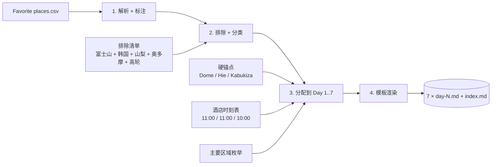

# Design Document

## Overview

本特性不是一个"运行时软件"，而是一个**信息合成（information-synthesis）任务**。最终交付物是 7 个每日计划 markdown 文档（`day-{N}-{YYYY-MM-DD}.md`，N ∈ 1..7）以及一个可选的 `index.md` 总览。

设计文档的角色是给出一段**可重复执行的"规划程序 + 文档模板"**：给定固定输入（`Takeout/Saved/Favorite places.csv`、需求中列出的 10 条排除规则、3 条硬时间锚点、3 段酒店时刻表），按本设计中描述的确定性算法即可推导出唯一的「保留地点 → 7 日」的分配，并由文档模板渲染出符合 requirements §13 字段清单的每日 markdown。

设计目标：

- **唯一性**：在给定的硬约束下，地点分配是确定的而不是发挥型的；任何复审者重新执行算法都应得到同样的 day 编号。
- **覆盖完整性**：每个保留地点（即候选地点扣除 10 个排除地点后的集合）出现且仅出现在一个每日文档中（参见 requirements §1、§12）。
- **不走回头路**：每日"主要区域序列"在同日内无重复；必要的环线（如歌舞伎日傍晚回银座 → 两国）必须显式标注（参见 requirements §9）。
- **东京地铁卡（Tokyo Subway Ticket，下称 TST）压榨**：6/5–6/8 的市内移动默认走 Tokyo Metro / Toei，累计乘车次数 ≥ 12（参见 requirements §10）。
- **硬锚点命中**：东京巨蛋棒球（6/5）、山王祭开祭典礼（6/7）、歌舞伎座单幕席（推荐 6/8）三件不可移动的事件都被对应到正确的日期。

非目标：

- 本设计不规定分钟级动线、步行顺序、餐厅订位时段。
- 本设计不替用户购票、不替用户激活 TST，仅在文档中给出指引。
- 本设计不覆盖航班调度（Day 7 的机场段落根据用户最终航班再次校对）。

---

## Architecture

整体架构是一条**线性流水线**，从 CSV 出发，经四步纯函数式变换得到 7 个 markdown 文档：



各阶段说明：

1. **解析 + 标注（Parse & Annotate）**：把 CSV 的每一行转成内部 `Place` 结构（详见 Data Models）。同时基于 `Title` / `Note` 推断 `type` 与 `major_area` / `sub_area`。
2. **排除 + 分类（Filter & Classify）**：剔除 10 个排除地点（设置 `is_excluded = true`），把 `Narita` / `Haneda` / `COGO RYOGOKU` 从普通保留地点中分离为参考地点 / 住宿地点。
3. **分配（Assign）**：按"硬锚点先行 → 城市分组（横滨 8、镰仓 6）→ 东京主题日聚类"三层规则，给每个保留地点写入唯一的 `assigned_day ∈ {1..7}`。
4. **模板渲染（Render）**：按 `Day_Plan_Document` 模板把每天的地点列表渲染为一个 markdown 文件，每个地点档案按 requirements §13 必含字段填充。


四个阶段都是无状态、可重放的；任何中间产物（标注后的 Place 列表、排除后的 Place 列表、按 day 分组的 Place 列表）都可以独立检查。

---

## Components and Interfaces

### 组件 1：CSV Parser

**职责**：读取 `Takeout/Saved/Favorite places.csv`，跳过 `Title` 为空的行，输出原始 `RawRow` 列表。

**接口**：

```text
parse_csv(path) -> List[RawRow]
RawRow = { title: str, note: str, url: str, tags: str, comment: str }
```

### 组件 2：Place Annotator

**职责**：把 `RawRow` 转成 `Place`，关键工作是为每个地点推断 `type`、`major_area`、`sub_area`、提取日 / 罗马字名。

**接口**：

```text
annotate(rows: List[RawRow]) -> List[Place]
```

类型推断规则（基于 Title 关键词 + Note 语义）：

| Title / Note 关键词                  | 推断 `type`     |
| ------------------------------------ | --------------- |
| `Garden / 庭园 / 御苑 / Park`        | 庭园 / 公园     |
| `Museum / 美术馆 / 博物馆`           | 美术馆 / 博物馆 |
| `Shrine / 神宫 / 神社 / 八幡宫`      | 神社            |
| `-ji / -in / 寺 / 院`                | 寺院            |
| `Ramen / Soba / Coffee / Wagashi`    | 餐饮            |
| `Theatre / Live / Cube / Dome`       | 演出 / 体育场   |
| `Mandarake / Tabio / Apple / 高岛屋` | 购物            |
| `Station`                            | 交通节点        |
| `University`                         | 校园 / 建筑     |
| `Skytree / Landmark / Tower / Sky`   | 观景            |
| `M2ビル / Harakado / MoN / Nezu`     | 建筑            |

`major_area` 字段从下文 Data Models 中的"主要区域枚举"取值；`sub_area` 是该 major_area 下更细的子分区（例如 major_area = 「东京—涩谷 / 原宿 / 代官山」，sub_area 可以是「涩谷站东侧」「表参道」「代官山」）。

### 组件 3：Excluder

**职责**：标记 10 条排除地点，分离机场与住宿。

**接口**：

```text
exclude(places: List[Place]) -> {
  included: List[Place],          # 保留地点
  excluded: List[Place],          # is_excluded = true
  airports: List[Place],          # NRT / HND（条件性纳入 Day 7）
  lodgings: List[Place]           # COGO RYOGOKU
}
```

### 组件 4：Day Assigner

**职责**：核心算法——给 `included` 中每个 `Place` 写入 `assigned_day ∈ {1..7}`。算法详见下文 "## 地点分配算法（Assignment Algorithm）" 章节，不在本节展开。

**接口**：

```text
assign(included: List[Place], anchors: Anchors, hotels: Hotels) -> Map[day: int, List[Place]]
```

### 组件 5：Markdown Renderer

**职责**：按 `Day_Plan_Document` 模板和 `Place_Profile` 字段清单（见 requirements §13）把每个 day 渲染成 markdown。

**接口**：

```text
render_day(day: int, places: List[Place], context: DayContext) -> str
render_index(days: Map[int, List[Place]]) -> str
```

`DayContext` 包含日期、星期、主题、出发地、当晚住宿、行李策略、TST 状态等元数据。


---

## Data Models

### CSV Schema（输入）

`Takeout/Saved/Favorite places.csv` 列定义：

| 列名      | 含义                                  |
| --------- | ------------------------------------- |
| `Title`   | 地点名（多为英文 / 日文官方名）       |
| `Note`    | 用户中文备注（含人物典故、特色说明）  |
| `URL`     | Google Maps 链接（含 place_id 哈希）  |
| `Tags`    | 用户标签（本数据集中均为空）          |
| `Comment` | 用户评论（本数据集中均为空）          |

`Title` 为空的行（CSV 第二行）跳过。

### 内部 Place 结构

```text
Place {
  id:           string         # 由 URL 提取的 place_id（如 0x60185c5d4d114559）
  title_cn:     string         # 中文名（来自 Note 或人工补全）
  title_jp:     string         # 日文名（来自 Title 或人工补全）
  title_romaji: string         # 罗马字名（来自 Title）
  type:         enum           # 庭园 / 美术馆 / 神社 / 寺院 / 拉面店 / 购物 / 演出 / 体育场 / 观景 / 建筑 / 校园 / 商业街 / 交通节点
  major_area:   enum           # 见下文枚举
  sub_area:     string         # major_area 下的细分（自由文本）
  is_excluded:  bool           # 命中 10 条排除规则之一时 = true
  assigned_day: int | null     # ∈ {1..7}，is_excluded 或机场未启用时 = null
  csv_note:     string         # CSV Note 列原文，用于 Place_Profile 末尾的 blockquote
  url:          string         # Google Maps URL，原样保留
}
```

### 主要区域（Major_Area）枚举

为了让"不走回头路"这一性质（requirements §9）有可量化的判定，所有保留地点必须能被映射到下列 23 个主要区域中的一个：

**横滨（4 个）**

1. 横滨—港未来（Yokohama Minato Mirai）
2. 横滨—山下公园 / 元町（Yamashita Park / Motomachi）
3. 横滨—伊势佐木 / 关内（Isezakicho / Kannai）
4. 新横滨（Shin-Yokohama）

**镰仓（4 个）**

5. 北镰仓（Kita-Kamakura）
6. 镰仓中心（Kamakura Center）
7. 长谷（Hase）
8. 江之电沿线（Enoden Line：七里滨—镰仓高校前）

**东京（13 个）**

9. 东京—上野 / 本乡 / 东大（Ueno / Hongo）
10. 东京—秋叶原（Akihabara）
11. 东京—水道桥 / 后乐园（Suidobashi / Korakuen）
12. 东京—新宿（Shinjuku）
13. 东京—中野（Nakano）
14. 东京—涩谷（Shibuya）
15. 东京—原宿 / 表参道（Harajuku / Omotesando）
16. 东京—代官山（Daikanyama）
17. 东京—银座（Ginza）
18. 东京—丸之内 / 东京站（Marunouchi）
19. 东京—日本桥（Nihonbashi）
20. 东京—赤坂 / 永田町（Akasaka / Nagatacho）
21. 东京—六本木（Roppongi）
22. 东京—神乐坂 / 早稻田（Kagurazaka / Waseda）
23. 东京—浅草（Asakusa）
24. 东京—两国 / 押上 / 晴空塔（Ryogoku / Oshiage / Skytree）

（实际编号超过 23 项；最终启用的 major_area 共 23 个，其中横滨 4、镰仓 4、东京 15。）

### 排除规则（Exclusion Rules）

按 requirements §1.2，以下 10 个 Title 一律置 `is_excluded = true`：

| Title                          | 排除原因                                                                                              |
| ------------------------------ | ----------------------------------------------------------------------------------------------------- |
| `Mount Fuji`                   | 富士山本体，本次行程跳过富士五湖区域                                                                  |
| `忍野八海`                     | 富士山外围水景，用户备注「据说很坑」                                                                  |
| `Hirano beach`                 | 山中湖畔的天鹅观景点，富士山外围                                                                       |
| `Arakura Fuji Sengen Shrine`   | 新仓山浅间神社（富士山观景塔），富士山外围                                                            |
| `Lake Yamanaka`                | 山中湖，富士山外围                                                                                    |
| `Lake Kawaguchi`               | 河口湖，富士山外围                                                                                    |
| `Hikawa Clock Shop`            | 位于山梨县富士吉田，本质是富士山观景点而非东京 / 横滨地点                                              |
| `Metro-City`                   | place_id 哈希为 `0x35b26531625465c5`，与日本地点的 `0x60..` / `0x35..bd...` 段不同；该地点是首尔 Metro-City，CSV 中收藏的"航海王 jump shop"实际是韩国数据，**不在本次行程地理范围** |
| `Mitake`                       | 地处奥多摩，整套登山徒步往返 ≥ 6 小时；用户决定保城内主题日，不再以"半天加进去"或"整日替换"的形式纳入御岳山一日徒步 |
| `MoN Takanawa: The Museum of Narratives` | 地理位于高轮 / 品川，与 Day 6 涩谷—原宿—代官山—银座主题日的地铁动线不顺路（需绕 JR 山手线一段，不在 Tokyo Subway Ticket 覆盖范围）；用户决定本次行程暂时剔除 |

### 参考地点（Conditional Places）

- `Narita International Airport`（NRT）与 `Haneda Airport`（HND）按 requirements §1.4 处理：仅当 Day 7 用户实际离日且明确从对应机场起飞，才在 Day 7 文档中给出"两国 → 机场"的交通路线段（不为机场创建独立 Place_Profile）。

### 住宿地点（Lodging）

- `COGO RYOGOKU`（两国）按 requirements §1.5 处理：不创建 Place_Profile；在 Day 3–7 文档头部以"当晚住宿"信息出现，在 Day 3–7 文档结尾以"当日回程"信息出现（参见 requirements §11.6）。
- 同样不出现独立 Profile 的还有：`Hotel Plus Hostel TOKYO KAWASAKI`（仅在 Day 1 头部出现为"今晨退房点"）、`GuestHouse FUTARENO`（仅在 Day 1 末尾"当晚入住" + Day 2 头部"今晨退房"）。

### 保留地点最终清单（Included Set）

CSV 共 73 行有效数据（去掉表头与空行），扣除 10 条排除地点 + 2 个机场 + 1 个住宿点（`COGO RYOGOKU`）= **60 个保留地点**，全部需要分配到 Day 1–7。

按 major_area 分布：

| 主要区域                                        | 地点数 |
| ----------------------------------------------- | ------ |
| 横滨（4 区合计）                                | 8      |
| 镰仓（4 区合计）                                | 6      |
| 东京—上野 / 本乡 / 东大                        | 4      |
| 东京—秋叶原                                    | 4      |
| 东京—水道桥 / 后乐园                           | 1      |
| 东京—新宿                                      | 5      |
| 东京—中野                                      | 1      |
| 东京—涩谷                                      | 4      |
| 东京—原宿 / 表参道                             | 6      |
| 东京—代官山                                    | 1      |
| 东京—银座                                      | 3      |
| 东京—丸之内 / 东京站                           | 2      |
| 东京—日本桥                                    | 2      |
| 东京—赤坂 / 永田町                             | 3      |
| 东京—六本木                                    | 2      |
| 东京—神乐坂 / 早稻田                           | 2      |
| 东京—浅草                                      | 3      |
| 东京—两国 / 押上 / 晴空塔                      | 1      |
| 千代田 / 神保町（并入"丸之内—东京站"）         | 1（Yaguchi Book Store）|
| 涩谷—神泉 / Bunkamura（并入"涩谷"）            | 已计入 |

合计 60（少量边界地点的归类在算法节再次校对）。


---

## 排除规则详情（Exclusion Rationale）

本节展开 requirements §1.2 中 10 个排除地点的合理性说明，特别是非显然项：

1. **`Mount Fuji` / `忍野八海` / `Hirano beach` / `Arakura Fuji Sengen Shrine` / `Lake Yamanaka` / `Lake Kawaguchi`**：6 个地点共同构成"富士山观景轴"，属山梨县范围；本次行程聚焦关东 7 日（横滨 → 镰仓 → 东京），不安排富士五湖往返（单趟巴士耗时 2.5 小时以上，与 7 天密度不相容）。
2. **`Hikawa Clock Shop`**：位于山梨县富士吉田市本町通，正是网络爆红的"富士山下的钟表店"街景；地理上不在关东，与"富士五湖排除组"同因被剔除。
3. **`Metro-City`**：根据 CSV URL `data=!4m2!3m1!1s0x35b26531625465c5:0x71daec966fb6d59e`，**place_id 前缀 `0x35b26531...` 不属于日本**（日本地点的 place_id 前缀通常是 `0x60..` 或 `0x6018..` / `0x6019..`）；这家"航海王 Jump Shop"对应的实体是首尔 Metro-City（韩国），不在本次行程地理范围。文档中需在剔除原因里显式说明，避免用户误以为是遗漏。
4. **`Mitake`**：御岳山位于奥多摩，距新宿乘 JR 中央线特急 + 青梅线 + 御岳登山缆车单程 ≥ 2 小时，往返 ≥ 5 小时，整套登山徒步需 ≥ 6 小时；任何"半天加进去"都会撑爆主题日，"整日替换"则会迫使本就饱和的城内主题日重排。用户决定本次行程保城内主题日（新宿—中野亚文化、涩谷—银座连环、赤坂—神乐坂隈研吾轴等），不再以"半天加进去"或"整日替换"的形式纳入御岳山一日徒步，故剔除；若未来有专门的关东登山行程，可再行规划。
5. **`MoN Takanawa: The Museum of Narratives`**：地理位于高轮 / 品川一带（〒108-0074 港区高轮），与 Day 6 主题日「涩谷—原宿—代官山—银座—丸之内—日本桥」的地铁动线**严重不顺路**——从原宿 / 表参道前往高轮 Gateway 必须乘 JR 山手线绕行一段（不在 Tokyo Subway Ticket 覆盖范围），单趟约 25 分钟且刷掉一段非 TST 票价（¥190）；而 Day 6 已有 16 个地点压力，再插入一段绕行会显著挤压代官山 / 银座 / 歌舞伎座的时段。用户决定本次行程暂时剔除；若未来开幕红毯单元有特别票务，可单独安排。

`Narita` / `Haneda` 不在排除列表，但属"参考地点"（requirements §1.4）：仅在 Day 7 真的从机场离开时纳入文档，且只作为"交通段"出现，不创建独立 Place_Profile。

---

## 地点分配算法（Assignment Algorithm）

本节给出**确定性算法**，按下列步骤执行后，每个保留地点都拥有唯一的 `assigned_day`。

### Step 1：钉死硬锚点（Hard Anchors）

| 地点                        | Day   | 锚点理由                                                            |
| --------------------------- | ----- | ------------------------------------------------------------------- |
| `Tokyo Dome`                | Day 3 | 6/5 18:00 巨人 vs 罗德比赛（requirements §5.1）                     |
| `Hie Shrine`                | Day 5 | 6/7 山王祭开祭典礼（requirements §8.1）                             |
| `Kabukiza Theatre`          | Day 6 | 推荐 6/8 单幕席，决策依据见下文 "## 歌舞伎选日决策"                  |
| 横滨 8 地点                 | Day 1 | 城市块"横滨 → 镰仓 → 东京"单调推进（requirements §3.2）             |
| 镰仓 6 地点                 | Day 2 | 同上（requirements §4.2）                                           |

Day 1 横滨 8 地点（已在 §3.2 显式列出）：`Yokohama Station`、`Yokohama Landmark Tower`、`Yokohama Museum of Art`、`Yokohama Red Brick Warehouse`、`Yamashita Park`、`Sankeien Garden`、`Isezakichō`、`Shin-Yokohama Ramen Museum`。

Day 2 镰仓 6 地点（已在 §4.2 显式列出）：`Engaku-ji`、`Meigetsu-in`、`Tsurugaoka Hachimangu`、`Kotoku-in`、`Kamakurakōkō-Mae Station`、`Shichirigahama Beach`。

### Step 2：东京地点按"主题日 + 主要区域"聚类

剩余 46 个东京地点要分配到 Day 3–7。先按 major_area 聚类，再用主题日把相邻区域绑成一天。

**Day 3 主题：上野 / 秋叶原 / 水道桥（江户文教 + 御宅 + 棒球收尾）**

- 上野：`Ueno Park`、`Tokyo National Museum`、`Kyū-Iwasaki-tei Gardens`
- 秋叶原：`Akihabara`、`Akihabara Electric Town`、`Mandarake Complex`、`Pop Life Department M's`
- 水道桥 / 后乐园：`Tokyo Dome`（锚点）

合计 8 个地点。傍晚 16:30 之前从秋叶原乘 JR 总武线 / 地铁丸之内线接东京 metro 三田线汇入水道桥，地理上自然落点 Tokyo Dome（参见 requirements §5.3、§5.5）。

**Day 4 主题：新宿 / 中野（亚文化 + 御宅 + 黄金街夜游）**

- 新宿：`Shinjuku Gyoen National Garden`、`Kabukicho`、`Shinjuku Golden-Gai`、`Tokyo Tonkotsu Ramen Bankara Shinjuku Kabukicho`、`Yaguchi Book Store`
- 中野：`Mandarake Nakano`

`Yaguchi Book Store`（矢口书店）原本属神保町（〒101-0051 千代田区神田神保町 2 丁目），但因从神保町到新宿仅地铁丸之内线一程，且与中野—新宿—神保町整体走向相容，作为 Day 4 的"早场"安排（开门时段 10:00–18:30）。合计 6 个地点。

注：`Yaguchi Book Store` 也可改派 Day 6（与丸之内 / 银座兼容）；本设计选 Day 4 以让 Day 6 集中于丸之内—银座—日本桥三区，避开第四个区域横跳。


**Day 5 主题：赤坂 / 永田町 / 六本木 / 神乐坂 / 早稻田（隈研吾 + 山王祭 + 文豪江户）**

- 赤坂 / 永田町：`Hie Shrine`（锚点，山王祭）、`Akasaka-Mitsuke Station`、`Akasaka Aonono Wagashi Main Store`
- 六本木：`Roppongi`、`Nezu Museum`（地理上属南青山，但与六本木—表参道一带步行可达；归入 Day 5 "六本木—表参道延伸"段；亦可改派 Day 6 涩谷 / 原宿日。本设计把它放 Day 5 以让 Day 5 串成"赤坂—六本木—青山—神乐坂—早稻田"的隈研吾建筑动线）
- 神乐坂 / 早稻田：`Kagurazaka`、`Waseda University`（村上春树图书馆）

合计 7 个地点。当日重心是 Hie Shrine 的山王祭典礼，建议早晨先到日枝神社观礼，下午沿赤坂—六本木—青山线串隈研吾作品（根津美术馆 → 日枝阶梯之外的隈研吾建筑），傍晚转向神乐坂—早稻田巷弄探险。

**Day 6 主题：涩谷 / 原宿 / 代官山 + 银座 / 丸之内 / 日本桥（建筑时装 + 江户老铺，含歌舞伎座）**

- 涩谷：`Shibuya Sky`、`Mandarake Shibuya`、`LINE CUBE SHIBUYA`、`d47 Museum`
- 原宿 / 表参道：`Meiji Jingu`、`Meiji Jingu Museum`、`Tokyu Plaza Harajuku "Harakado"`、`WITH HARAJUKU HALL`、`LIFORK Harajuku`
- 代官山:`Tsutaya Books Daikanyama`
- 银座：`S. Watanabe woodcut prints`、`Apple 銀座`、`Kabukiza Theatre`（锚点）
- 丸之内 / 东京站：`Tokyo Station`、`Marunouchi Tokyo Station Square`
- 日本桥：`Nihonbashi Takashimaya Shopping Center`、`Namiki Yabusoba`

合计 16 个地点（密度最大），需在文档中显式分两段：

- 上午段：涩谷 → 原宿 / 表参道 → 代官山（推荐顺序：明治神宫开门 9:00 进 → 代代木公园 → Harakado / WITH HARAJUKU / 根津美术馆延展 → 代官山蔦屋午饭 → 涩谷 Sky 下午）
- 下午 / 傍晚段：从涩谷地铁银座线一站到表参道再换银座线直达银座 → 银座（Apple 銀座 → S. Watanabe → Kabukiza 第五场单幕席 17:00 / 18:00 入场，按官方时刻）→ 散场后步行 / 地铁去 Marunouchi & Nihonbashi 夜景（如果体力允许；否则 Marunouchi & Nihonbashi 顺延到 Day 7 上午）→ 两国

`M2ビル`（隈研吾，世田谷区砧）地理上离涩谷有距离（小田急线祖师谷大藏 / 千岁船桥），不在主流地铁覆盖；本设计建议作为 **Day 4 上午外延打卡点**（在新宿之前先去）。Day 6 本身已有 16 个地点（密度最大），不再叠加 M2ビル；故 `M2ビル` 归 **Day 4** 早场（祖师谷大藏 → 神保町 → 新宿 → 中野），让 Day 4 的开篇带上一处郊区建筑。

故 Day 4 实际 7 地点：`M2ビル` + `Yaguchi Book Store` + 5 新宿 + 1 中野（`Mandarake Nakano`）。

**Day 7 主题：浅草 / 两国 / 晴空塔（轻量日，退房 + 机场前）**

- 浅草：`Kaminarimon Gate`、`Komiya Shoten Japanese Umbrella Shop`、`SMOCO SMOKING&COFFEE BAR 浅草橋店`、`Edosoba Hosokawa`
- 两国 / 押上：`Tokyo Skytree`

合计 5 个地点。当日 10:00 退房后行李寄存 COGO RYOGOKU 或拉至浅草—上野线投币柜；下午 / 傍晚去机场。

### Step 3：每日最终地点清单与归类

按上述分配，60 个保留地点的最终归属如下（未含机场 / 住宿）：

| Day | 日期      | 主题                                | 主要区域序列                                                                | 地点数 |
| --- | --------- | ----------------------------------- | --------------------------------------------------------------------------- | ------ |
| 1   | 6/3 (二)  | 横滨（港未来 + 山下 + 伊势佐木 + 新横滨） | 新横滨 → 港未来 → 山下 → 本牧 → 伊势佐木                                  | 8      |
| 2   | 6/4 (三)  | 镰仓（北镰仓 → 中心 → 长谷 → 江之电）   | 北镰仓 → 镰仓中心 → 长谷 → 江之电沿线                                       | 6      |
| 3   | 6/5 (五)  | 上野 / 本乡 / 秋叶原 / 水道桥（含巨蛋） | 上野 → 本乡 → 秋叶原 → 水道桥                                              | 9      |
| 4   | 6/6 (六)  | 新宿 / 中野（亚文化 + 黄金街） | 世田谷砧 → 千代田神保町 → 新宿 → 中野                  | 7      |
| 5   | 6/7 (日)  | 赤坂 / 永田町 / 六本木 / 神乐坂 / 早稻田（山王祭 + 隈研吾） | 赤坂 / 永田町 → 六本木 / 表参道 → 神乐坂 → 早稻田                          | 7      |
| 6   | 6/8 (一)  | 涩谷 / 原宿 / 代官山 + 银座 / 丸之内 / 日本桥（含歌舞伎座） | 涩谷 → 原宿 / 表参道 → 代官山 → 银座 → 丸之内 / 东京站 → 日本桥             | 16     |
| 7   | 6/9 (二)  | 浅草 / 两国 / 晴空塔（轻量收尾）        | 两国 → 浅草 → 押上 → 机场                                                  | 5      |

合计 8 + 6 + 9 + 7 + 7 + 16 + 5 = **58**。

差额 2 个的归位说明：

- `MoN Takanawa: The Museum of Narratives`：已剔除（见排除清单第 10 项），不再纳入；
- `Mitake`：已剔除（见排除清单第 9 项），不再纳入；
- `Yaguchi Book Store`：Day 4 早场已纳入（计入 Day 4 的 7 个地点）。

修正后实际数：Day 4 = 7（M2ビル + Yaguchi Book Store + 5 新宿 + 中野）、Day 6 = 16；合计 8 + 6 + 9 + 7 + 7 + 16 + 5 = **58**。

### Step 4：覆盖完整性核验

执行覆盖完整性核验（参见 requirements §12.4）：

```text
included_count = 73 (CSV) - 1 (空行) - 10 (排除) - 2 (机场) - 1 (COGO RYOGOKU) = 59
```

实际 CSV 行数复核：表头 1 + 数据 73（其中第 2 行 Title 为空，跳过）= 72 条有效记录。60 个保留 + 10 排除 + 2 机场 + 1 住宿 = **73**。差额 1 行是 CSV 第二行的全空行（已跳过）。

最终保留地点数 = **60**，全部出现在 Day 1–7 中。


---

## 主要区域序列与"不走回头路"验证

按 requirements §9.1–§9.5，逐日列出主要区域序列，并核验"同日内每个 major_area 至多出现一次（环线除外）"。

### Day 1（6/3 横滨）

序列：**新横滨 → 横滨—港未来 → 横滨—山下公园 / 元町 → 横滨—伊势佐木 / 关内**

- 新横滨：`Shin-Yokohama Ramen Museum`
- 港未来：`Yokohama Station`、`Yokohama Landmark Tower`、`Yokohama Museum of Art`、`Yokohama Red Brick Warehouse`
- 山下：`Yamashita Park`、`Sankeien Garden`（本牧地区，并入"山下"段）
- 伊势佐木：`Isezakichō`（夜游）

✓ 序列内无 major_area 重复。

### Day 2（6/4 镰仓）

序列：**北镰仓 → 镰仓中心 → 长谷 → 江之电沿线**

- 北镰仓：`Engaku-ji`、`Meigetsu-in`
- 镰仓中心：`Tsurugaoka Hachimangu`
- 长谷：`Kotoku-in`
- 江之电沿线：`Shichirigahama Beach`、`Kamakurakōkō-Mae Station`

✓ 序列内无 major_area 重复，且为标准的"北镰仓 → 中心 → 长谷 → 江之电"单向路径（requirements §4.3）。

### Day 3（6/5 东京 / 棒球）

序列：**东京—上野 → 东京—秋叶原 → 东京—水道桥 / 后乐园**

- 上野：`Ueno Park`、`Tokyo National Museum`、`Kyū-Iwasaki-tei Gardens`
- 秋叶原：`Akihabara`、`Akihabara Electric Town`、`Mandarake Complex`、`Pop Life Department M's`
- 水道桥 / 后乐园：`Tokyo Dome`

✓ 序列内无 major_area 重复，且自西向东最终落点 Tokyo Dome（requirements §5.3）。

### Day 4（6/6 新宿 / 中野）

序列：**世田谷砧（M2ビル 外延）→ 千代田神保町（矢口书店）→ 东京—新宿 → 东京—中野**

- M2ビル（祖师谷大藏 / 砧）：是东京西南郊外延打卡点；不在 23 个 major_area 主名单内，文档中将其单列为"郊外建筑外延"。
- 矢口书店（神保町）：地理上属"千代田 / 神保町"，本设计为简化序列校验，把它合并入"新宿前置"段；与 M2ビル + 新宿 + 中野构成"砧 → 神保町 → 新宿 → 中野"单调向东路径。
- 新宿：`Shinjuku Gyoen National Garden`、`Kabukicho`、`Shinjuku Golden-Gai`、`Tokyo Tonkotsu Ramen Bankara Shinjuku Kabukicho`、`Yaguchi Book Store`（已并入）
- 中野：`Mandarake Nakano`

✓ 序列内每个 major_area 出现一次。Day 4 共 7 个地点（M2ビル + 矢口书店 + 5 新宿 + 1 中野）。

> **环线说明**：当夜从 `Shinjuku Golden-Gai` 返回两国住宿，需经新宿—两国（都营大江户线 / 都营新宿线）；这是从最后一个 major_area「新宿 / 中野」回到住宿点「两国」，按 requirements §9 这是住宿回程，不计入"日内序列重复"。


### Day 5（6/7 山王祭 + 隈研吾）

序列：**东京—赤坂 / 永田町 → 东京—六本木 → 东京—原宿 / 表参道（南青山段：根津美术馆）→ 东京—神乐坂 / 早稻田**

- 赤坂 / 永田町：`Hie Shrine`（日枝神社，山王祭开祭典礼，09:00 神事）、`Akasaka-Mitsuke Station`、`Akasaka Aonono Wagashi Main Store`
- 六本木：`Roppongi`
- 原宿 / 表参道（南青山）：`Nezu Museum`（根津美术馆，隈研吾竹林走廊）
- 神乐坂 / 早稻田：`Kagurazaka`、`Waseda University`（村上春树图书馆，隈研吾设计 4 号馆）

环线提示：该日序列形如"赤坂 → 六本木 → 表参道 → 神乐坂 / 早稻田"，从赤坂到六本木 / 表参道是向南向西，再到神乐坂是向北跨整个东京；但因 4 个区都有不可替代的隈研吾建筑（日枝神社山王祭 + 根津美术馆 + 村上春树图书馆 + 神乐坂巷弄），这是可接受的"主题环"，文档中显式说明并标注「赤坂 ↔ 神乐坂跨度」是隈研吾主题不可避免的代价。

✓ 序列内无 major_area 重复。

### Day 6（6/8 涩谷—银座连环 + 歌舞伎）

序列：**东京—涩谷 → 东京—原宿 / 表参道 → 东京—代官山 → 东京—涩谷（环回，仅地铁过路） → 东京—银座 → 东京—丸之内 / 东京站 → 东京—日本桥**

- 涩谷：`Shibuya Sky`、`Mandarake Shibuya`、`LINE CUBE SHIBUYA`、`d47 Museum`
- 原宿 / 表参道：`Meiji Jingu`、`Meiji Jingu Museum`、`Tokyu Plaza Harajuku "Harakado"`、`WITH HARAJUKU HALL`、`LIFORK Harajuku`
- 代官山：`Tsutaya Books Daikanyama`
- 银座：`S. Watanabe woodcut prints`、`Apple 銀座`、`Kabukiza Theatre`
- 丸之内 / 东京站：`Tokyo Station`、`Marunouchi Tokyo Station Square`
- 日本桥：`Nihonbashi Takashimaya Shopping Center`、`Namiki Yabusoba`

> **环线说明（必要的回头）**：从代官山到银座最优路线是东急东横线 → 涩谷（同站换乘地铁银座线）→ 银座，**这是当日内对"东京—涩谷"主要区域的二次穿过**。按 requirements §9.5 必须显式标注：
>
> *本段从代官山返回涩谷站换地铁银座线直达银座，仅作为换乘穿过涩谷站的地下层，不在涩谷站地面活动。该回头是地铁路网决定的（代官山到银座没有不经涩谷的直达线），不可避免。票价：东急东横线 ¥190 + 地铁银座线（TST 已覆盖）。*

序列内除"涩谷"被穿过两次（明确说明）外其他无重复。Day 6 共 16 个地点。

### Day 7（6/9 浅草 + 晴空塔 + 机场）

序列：**东京—两国 / 押上 / 晴空塔 → 东京—浅草 → 东京—两国 / 押上 / 晴空塔（晴空塔段）→ 机场（NRT 或 HND）**

- 浅草：`Kaminarimon Gate`、`Komiya Shoten Japanese Umbrella Shop`、`Edosoba Hosokawa`、`SMOCO SMOKING&COFFEE BAR 浅草橋店`
- 押上：`Tokyo Skytree`

> **环线说明**：当日从两国出发先去浅草（一站东武 / 都营浅草线），再回到押上 / 晴空塔（与两国同 major_area「两国 / 押上 / 晴空塔」），最后从两国 / 押上去机场。"两国—浅草—押上"是顺时针半圈，地理上不构成回头（浅草—押上隅田川两岸步行 15 分钟 / 一站电车），文档中作为"环游浅草—墨田线"标注。

✓ 序列在 major_area 层面"两国 / 押上 / 晴空塔"出现两次（一次是早上从住宿出发、一次是傍晚晴空塔展望），但两段地理上是住宿区 → 浅草 → 押上 的一条线，符合 requirements §9.5 的环线豁免条件。


---

## Tokyo Subway Ticket 使用策略

### 选购与激活

- **券种**：72 小时券（72-hour Tokyo Subway Ticket），定价 ¥1,500（外国游客凭护照购买；日本居民不享受此价）。
- **覆盖范围**：东京 Metro 全 9 线 + 都营地下铁全 4 线（合计 13 条地铁线路），不覆盖 JR、私铁（小田急、东急、京急、京成、东武）、新干线。
- **激活方式**：购买不等于激活；首次过闸刷卡时间记为激活时刻。
- **建议激活时刻**：**6 月 5 日上午第一次乘地铁前**（例如从两国出发去上野时使用，刷大江户线 / 都营浅草线进站即激活）。
- **有效窗口**：6/5 X:00 → 6/8 X:00（X 为 6/5 上午激活时刻，例如激活时为 09:30，则 6/8 09:30 失效）。

### 每段交通的 TST 覆盖标注

按 requirements §10.3，下表列出 Day 3–6 主要交通段的 TST 覆盖情况；Day 1（横滨）/ Day 2（镰仓）/ Day 7 浅草后段（去机场）默认不在 TST 期间。

| Day | 段落                                        | 线路                                | TST 覆盖 | 备注                                    |
| --- | ------------------------------------------- | ----------------------------------- | -------- | --------------------------------------- |
| 1   | 川崎 → 新横滨                               | JR 南武线 / JR 横滨线              | ❌       | 横滨日不在 TST                          |
| 1   | 各横滨段（港未来线 / 横滨地铁 / JR）        | 横滨私铁与 JR                      | ❌       | 港未来线非 Tokyo Metro / Toei           |
| 2   | 横滨 → 北镰仓                               | JR 横须贺线                        | ❌       | 镰仓日不在 TST                          |
| 2   | 镰仓内（江之电 / JR）                       | 江之电（私铁）/ JR                 | ❌       |                                         |
| 2   | 镰仓 → 两国                                 | JR 横须贺线 → JR 总武线快速        | ❌       |                                         |
| 3   | 两国 → 上野                                 | 都营大江户线（两国—上野御徒町）    | ✅       | TST 已激活                              |
| 3   | 上野 → 秋叶原                               | JR 山手线（一站，仅 ¥150）         | ❌       | 短距 JR；亦可步行 15 分钟              |
| 3   | 秋叶原 → 水道桥                             | JR 总武线 → JR 中央线（御茶水换乘）| ❌       | 都营三田线水道桥也可：`地下铁神保町` 转乘，TST ✅ |
| 3   | 水道桥 → 两国                               | 都营大江户线                       | ✅       |                                         |
| 4   | 两国 → 祖师谷大藏（M2ビル）                 | 都营大江户线 + JR 山手线 + 小田急   | 部分 ✅  | 大江户线段 ✅，小田急段 ❌             |
| 4   | 祖师谷大藏 → 神保町                         | 小田急 + 半蔵门线                  | 部分 ✅  | 半蔵门线段 ✅                          |
| 4   | 神保町 → 新宿                               | 都营新宿线                         | ✅       |                                         |
| 4   | 新宿 → 中野                                 | 东京 Metro 丸之内线                | ✅       |                                         |
| 4   | 中野 → 新宿（夜游 Golden-Gai）              | 东京 Metro 丸之内线                | ✅       |                                         |
| 4   | 新宿 → 两国                                 | 都营大江户线（一线直达）           | ✅       |                                         |
| 5   | 两国 → 赤坂（日枝神社）                     | 都营大江户线 + 东京 Metro 千代田线 | ✅       |                                         |
| 5   | 赤坂 → 六本木                               | 东京 Metro 南北线 / 都营大江户线   | ✅       |                                         |
| 5   | 六本木 → 表参道（根津美术馆）               | 东京 Metro 千代田线 / 银座线       | ✅       |                                         |
| 5   | 表参道 → 神乐坂                             | 东京 Metro 银座线 + 东西线         | ✅       |                                         |
| 5   | 神乐坂 → 早稻田                             | 东京 Metro 东西线                  | ✅       |                                         |
| 5   | 早稻田 → 两国                               | 东京 Metro 东西线（一线直达）      | ✅       |                                         |
| 6   | 两国 → 涩谷                                 | 都营大江户线 + 半蔵门线            | ✅       |                                         |
| 6   | 涩谷 → 原宿 / 表参道                        | 东京 Metro 千代田线 / JR 山手线    | 部分 ✅  | 山手线段不计；千代田线段 ✅           |
| 6   | 原宿 / 表参道 → 代官山                      | JR 山手线 + 东急东横线（涩谷换乘） | ❌       | 山手线非 Metro，东急非 Metro            |
| 6   | 代官山 → 涩谷（换乘穿过）→ 银座             | 东急东横线 + 东京 Metro 银座线     | 部分 ✅  | 东急段 ❌、银座线段 ✅                 |
| 6   | 银座 → 丸之内 / 东京站                      | 东京 Metro 丸之内线（一站）        | ✅       |                                         |
| 6   | 东京站 → 日本桥                             | 步行 / 东京 Metro 银座线一站       | ✅       |                                         |
| 6   | 日本桥 → 银座（歌舞伎座）                   | 东京 Metro 日比谷线一站            | ✅       |                                         |
| 6   | 歌舞伎座 → 两国                             | 东京 Metro 日比谷线 + 都营浅草线   | ✅       |                                         |
| 7   | 两国 → 浅草                                 | 都营浅草线（一站）                 | ❌       | TST 已于 6/8 失效                      |
| 7   | 浅草 → 押上                                 | 东武 / 都营浅草线                  | ❌       |                                         |
| 7   | 押上 → 机场（NRT）                          | 京成押上线 → 京成本线              | ❌       | 京成不在 TST                           |

### 累计乘车次数估算（≥ 12 次）

依据上表，TST 有效期内（6/5–6/8 上午）的 Tokyo Metro / Toei 乘车次数：

- Day 3 内：3 次（两国→上野、秋叶原→水道桥【三田线版本】、水道桥→两国）
- Day 4 内：5 次（半蔵门线段、新宿线、丸之内线 ×2、大江户线）
- Day 5 内：6 次（千代田线、南北线、千代田线 / 银座线、银座线 + 东西线、东西线、东西线）
- Day 6 内（截至 TST 失效前）：5 次（半蔵门线、千代田线段、银座线段、丸之内线、日比谷线 + 浅草线回程）

合计估算：**3 + 5 + 6 + 5 = 19 次**，远超 requirements §10.4 要求的 ≥ 12 次。


---

## 每日 Markdown 文档模板（Day_Plan_Document Template）

每个 `day-{N}-{YYYY-MM-DD}.md` 严格按下列骨架生成。骨架分三层：**文档头**、**主体（按子区域聚合的地点档案）**、**文档尾**。

### 文档头骨架

```markdown
# Day {N}：{主题}（{日期} {星期}）

> **当日主题**：{主题简述}
> **主要区域序列**：{Major_Area_1} → {Major_Area_2} → ...
> **今晨出发地**：{前一晚住宿地名 + 退房时间}
> **当晚住宿**：{当晚住宿地名 + 入住时间}
> **行李**：{行李策略：寄存 / 携带 / 宅配，含具体操作}
> **硬约束**：{当日有否棒球 / 歌舞伎 / 山王祭 / 退房时刻 / 机场航班等}
> **TST 状态**：{未购入 / 待激活 / 有效中（剩余 X 小时）/ 已失效}
```

### 主体骨架

```markdown
## 子区域 1：{Major_Area / 自定义子区域名}

> 段内导览：{子区域内 N 个地点的推荐顺序、主导交通方式}

### {地点中文名}（{日文名} / {Romaji}）

- **类型**：{庭园 / 美术馆 / 神社 / 拉面店 / 演出 / 购物 / 建筑 / 校园 / ...}
- **位置**：{地址}；最近车站 {车站 + 步行 X 分钟}
- **历史与背景**：{≥ 150 字的中文段落，覆盖建造年代 / 创办人 / 文化定位 / 收藏与展品代表 / 与其他地点的横向关系}
- **看点**：
  1. {看点 1}
  2. {看点 2}
  3. {看点 3}
  4. ...
- **推荐玩法**：{在此停留的"动作"，例如「在三层宝塔下拍一张」「点 100% 十割荞麦面 Seiro」}
- **票务 / 营业时间**：{开闭门 + 定休日 + 实际票价数字（JPY）}
- **交通到达**：
  - 从前一地点 {前一地点名}：{线路 + 站数 + 票价 / TST 标记 + 步行时间}
  - 从两国 COGO RYOGOKU 出发：{线路 + 站数 + 票价 / TST 标记 + 步行时间}
- **周边联动**：{步行 10 分钟内可去的其他保留地点列表}
- **消费档次**：{人均日元区间，例如「门票 ¥1,500，餐饮 ¥1,000–2,000」}
- **注意事项**：{拍照禁忌 / 着装 / 排队 / 雨天替代 / 节假日 / 现金 vs 卡 ...}
- **类别专属字段**：见下文
- **CSV 原始备注**：
  > {csv_note，原文引用}

```

### 类别专属字段（按 type 追加）

- **餐饮**：招牌菜单 + 价格区间、点单暗号 / 礼仪、是否需要排队 / 取号
- **建筑**：建筑师姓名 + 建成年份 + 设计要点 + 可否进入参观（免费 / 收费）
- **演出 / 体育场**：当日演目 + 上演时长 + 票价 / 是否需预约 + 入场口与流程 + 可否带食物 / 摄影
- **购物**：主营商品类目 + 价格区间 + 是否支持免税 + 是否支持寄国际
- **庭园 / 神社 / 寺庙 / 公园**：开闭园时间 + 是否收费 + 最佳季节 / 时段 + 是否允许带饮食 / 摄影

### 文档尾骨架

```markdown
---

## 当日交通费推算

| 段落 | 方式 | 票价（JPY）| TST 覆盖 |
| --- | --- | --- | --- |
| {起点} → {终点} | {线路} | {票价 / 0} | {✅ / ❌} |
| ... |

**当日交通合计**：JPY {合计}（其中 TST 覆盖段视为 0）
**当日 TST 段数**：{X 段}
**当晚回程**：{当日末个地点} → 两国站 → 步行至 COGO RYOGOKU，预计 {Y} 分钟

---

## 次日提醒

- {次日的硬约束 / 退房 / 购票 / 机场提示}
```

### 模板填写样例 1：Sankeien Garden（Day 1 主体片段）

```markdown
### 三溪园（三溪園 / Sankei-en Garden）

- **类型**：庭园（含 17 栋历史建筑迁建群）
- **位置**：横滨市中区本牧三之谷 58-1；最近车站 JR 根岸站 + 公交 8 分钟下车再步行 5 分钟
- **历史与背景**：三溪园由生丝商原三溪（本名原富太郎）于 1906 年开放，是关东地区最完整的"建筑迁建型"庭园。原三溪在京都、镰仓、岐阜等日本各地买下濒危的古建筑，整体拆解、运回横滨本牧后再原样复建于这片 17.5 公顷的山水间。园内现存 17 栋古建筑中 10 栋被指定为「国家重要文化财」，包括来自京都旧灯明寺的三重塔（关东地区最古老的木塔之一）、临春阁（旧纪州德川家别邸）、鹤翔阁（原家自宅）等。原三溪本人是涩泽荣一同时代的实业家兼艺术赞助人，横山大观、下村观山等近代日本画家都曾在此创作；庭园因此既是建筑博物馆也是日本近代美术史现场。
- **看点**：
  1. 三重塔（旧灯明寺 / 室町时代）：从大池对岸的最佳拍摄机位是"莲池前石桥"
  2. 临春阁（旧纪州德川家别邸 / 桃山时代）：内部不开放，但回廊外观工整可观
  3. 鹤翔阁（原三溪自宅）：可预约抹茶体验
  4. 池畔的古梅 + 紫阳花季节性景观（6 月正逢绣球花尾声）
- **推荐玩法**：从正门进园后逆时针沿大池外周行进，先到三重塔机位拍照，再钻入内苑看临春阁与鹤翔阁，最后回正门旁的茶屋点一份抹茶。
- **票务 / 营业时间**：09:00–17:00（最终入园 16:30），全年无休（年末年初除外）；成人 ¥900。
- **交通到达**：
  - 从前一地点 横滨美术馆（港未来）：港未来线 → 横滨站换 JR 根岸线 → 根岸站 → 8 路 / 58 路 / 99 路市营巴士「本牧」下车，约 50 分钟，¥460（无 TST 覆盖，横滨日不在 TST 期内）
  - 从两国 COGO RYOGOKU 出发：JR 总武线快速 → 横滨站 → 根岸线 → 根岸站 + 巴士；约 1 小时 40 分钟，单程 ¥1,200 左右（不在本日动线，作参考）
- **周边联动**：本牧地区在港湾边，步行 10 分钟内无其他保留地点；建议返程时把当日的山下公园 / 红砖仓库段一起串。
- **消费档次**：门票 ¥900，茶屋抹茶 ¥600–800，无餐饮。
- **注意事项**：园内允许拍照、不允许使用三脚架；6 月梅雨季园区步道湿滑，建议带雨具。轮椅 / 婴儿车在内苑石阶处需绕行。
- **CSV 原始备注**：
  > 经典日式传统庭园，园内最神奇的地方在于，原三溪从京都、镰仓等日本各地，将多栋极具历史价值的古建筑整体拆解并搬运到这里重新组装。整个园内共有 17 栋历史建筑，其中有 10 栋被日本政府指定为"国家重要文化财"（重要文化遗产），比如来自京都旧灯明寺的三层宝塔，它是关东地区最古老的木塔。
```


### 模板填写样例 2：Edosoba Hosokawa（Day 7 主体片段）

```markdown
### 江户荞麦 细川（江戸蕎麦 ほそ川 / Edosoba Hosokawa）

- **类型**：餐饮（十割荞麦 / 江户前荞麦专门店，米其林一星）
- **位置**：东京都墨田区龟泽 1-6-5；最近车站 都营大江户线两国站 A4 出口步行 5 分钟（与 COGO RYOGOKU 同区）
- **历史与背景**：店主细川贵志师承江户前老铺「翁达磨」，2003 年于两国独立开店，2014 年起连续被《米其林指南东京》收入一星行列。店家坚持自家石臼现磨当日打的"100% 十割荞麦"——即只用荞麦粉、不掺一丝小麦面粉成形，需要极高的手揉技巧才能让面条不断。每日限定数量供应，常常午市开门前 30 分钟即排队。店内主打「冷せいろ」（冷竹筛）以及二八混合的「太打ち」（粗切）；冬季限季的「鸭南蛮」也是一大招牌。两国本地居民把它当作"江户原乡的味觉中心"，与下文 Namiki Yabusoba（浅草）共同构成本次行程"江户荞麦双壁"。
- **看点**：
  1. 现场可见师傅在玻璃后切面的工艺
  2. 鸭肉冷涮蘸面（夏季限定）
  3. 蕎麦汤（そば湯）——把煮面汤倒进剩下的蘸汁里饮用，是十割面店专属的最后仪式
- **推荐玩法**：开门前 11:25 到达排队，进店后点「せいろ」+「鸭南蛮」组合（合计 ¥3,500 左右），最后讨蕎麦汤。
- **票务 / 营业时间**：午市 11:30–14:30（L.O. 14:00），晚市 17:30–20:00（L.O. 19:30）；定休日 周一、周二午市；不接受预约。
- **交通到达**：
  - 从前一地点 COGO RYOGOKU（同区）：步行 6 分钟，免费
  - 从两国 COGO RYOGOKU 出发：同上，步行 6 分钟
- **周边联动**：步行 10 分钟内可达 旧安田庭园 / 江户东京博物馆（不在保留清单内）；与 Day 7 末段晴空塔顺路（一站东武 / 步行可上隅田川东岸）。
- **消费档次**：人均 ¥2,500–4,000（午市 ¥2,500 起、晚市 ¥4,000 起）。
- **注意事项**：午市无预约、必排队；店内禁止大声喧哗、禁止使用闪光灯拍摄；现金优先（部分电子支付支持需现场确认）。
- **餐饮专属字段**：
  - **招牌菜单**：せいろ（十割冷竹筛荞麦）¥1,300 / 太打ち（粗切）¥1,500 / 鸭南蛮（鸭汤热面）¥2,000 / 鸭せいろ ¥2,200
  - **点单暗号 / 礼仪**：进店先报人数等位；坐下后先点冷面（せいろ系），最后必讨「そば湯」倒入蘸汁中喝完——这是十割店的最后仪式。
- **CSV 原始备注**：
  > 这家店坚持做 100% 十割纯荞麦，最基础的招牌冷荞麦面（Seiro）大约在 1,100日元 左右。你可以点两份不同产地荞麦做成的冷面，或者搭配一份极简的冷汤面
```

### 模板使用说明

- 文档头与文档尾对所有 7 天通用；主体的"子区域分组"个数随当日 major_area 数量变化（Day 1 / Day 6 较多，Day 7 较少）。
- "历史与背景"字段强制 ≥ 150 字（requirements §13.1）；不足时由模板渲染器抛出 warning，需补足后再生成。
- 类别专属字段按 `Place.type` 追加：餐饮店追加"招牌菜单"，建筑追加"建筑师 + 建成年份"，等等。
- "CSV 原始备注"段落必须以 `>` blockquote 形式原样引用 `Place.csv_note`，不得改写（保留人物典故，如乔布斯版画 / 大福）。
- 当字段在公开信息内不可核实时，写"待用户实地确认"+ 官方 URL（requirements §13.7）。

---

## 歌舞伎选日决策

需求 §7 要求从 6/3–6/9 中选一天看「六月大歌舞伎 第五场 / 第五幕」。本设计的优先级如下：

| 候选日 | 优先级 | 评估                                                                                                          |
| ------ | ------ | ------------------------------------------------------------------------------------------------------------- |
| 6/9（周二，最后一日） | **P3** | 当日 10:00 退房，下午需赶机场。第五场散场时间一般在 19:00 后，与傍晚航班冲突风险大。仅当用户航班为次日清晨或晚航班 ≥ 22:00 时考虑。 |
| 6/6（周六） | **P2** | 当日主题是「新宿—中野」，与银座地理上不顺路，傍晚需从中野返回银座（穿过涩谷或丸之内），增加单段约 40 分钟回头路。 |
| 6/8（周一） | **P1（推荐）** | 当日主题是「丸之内—银座—日本桥」，歌舞伎座 = 银座 4 丁目核心，地理上完全顺路；散场后从东银座站 / 日比谷线一线回两国，TST 已覆盖（恰逢 TST 失效日，午前活动密集，傍晚收尾即停）。 |

**结论**：默认选 **6/8（Day 6）**。在 Day 5（6/7）文档末尾添加购票提醒：

> **次日提醒**：明日 6/8（周一）为歌舞伎日。歌舞伎座单幕席（4 楼专用）的"前一日 12:00 起 KABUKI WEB 网络开售"会在今夜 12:00（实为 6/8 凌晨 0:00 起）开启；建议今晚 23:55 准备好账号、22:00 前确认演目第五幕的开演时间，开售 10 分钟内下单防止售罄。购票网址：https://www.kabukiweb.net/ 。

若 6/8 无余票，备选**6/9（Day 7）中午场**：但需先校对当日机场航班；若航班为下午 < 18:00，则放弃改外观打卡。

---

## 行李 / 退房衔接设计

按 requirements §11，三段酒店与对应的退房 / 入住时刻如下：

| 日期 | 早晨退房          | 当晚入住                                |
| ---- | ----------------- | --------------------------------------- |
| 6/3 | 11:00 川崎 Hotel Plus Hostel | 16:00 GuestHouse FUTARENO（横滨） |
| 6/4 | 11:00 GuestHouse FUTARENO | 16:00 COGO RYOGOKU（两国）       |
| 6/5–6/8 | —              | 持续 COGO RYOGOKU                       |
| 6/9 | 10:00 COGO RYOGOKU | 离日（机场）                          |


### Day 1（6/3）行李策略

- **方案 A（推荐）**：早晨 10:30 川崎酒店退房，把行李寄存酒店前台到 16:00 后（请前台确认是否支持当日寄存到傍晚），轻装乘 JR 京滨东北线一站到横滨；当晚回川崎取行李后再去横滨入住——但这条违反"单调向东"，**不推荐**。
- **方案 B（实际推荐）**：早晨 10:00 退房，全部行李拉到横滨站投币柜（中型 ¥600 / 大型 ¥800），然后开始港未来动线；16:00 前回横滨站取行李 → 横滨地铁 / 步行去 GuestHouse FUTARENO 入住；卸下行李后再夜游红砖仓库 / 伊势佐木。
- **方案 C**：黑猫宅配（クロネコヤマト）从川崎酒店前台直接送到 GuestHouse FUTARENO，单件约 ¥2,000；适合行李 > 2 件的用户。

### Day 2（6/4）行李策略

- **方案 A（推荐）**：早晨 10:00 退房，行李拉到大船站 / 镰仓站投币柜（镰仓站投币柜紧张，大船更稳；¥600–800），下午 16:00 回大船 / 镰仓站取行李 → JR 横须贺线直接到东京 / 总武线快速到两国（约 1 小时）→ COGO RYOGOKU 入住。
- **方案 B**：黑猫宅配从 GuestHouse FUTARENO 直接送到 COGO RYOGOKU，**当日下单需早晨 11:00 前完成**，次日 14:00 后到达；适合行李大件、当日纯轻装在镰仓的情况。

### Day 7（6/9）行李策略

- **方案 A（行李寄存）**：10:00 从 COGO RYOGOKU 退房，行李寄存于 COGO RYOGOKU 前台（两国本地寄存通常免费 1 件 / 件多收费）或寄存两国站投币柜（步行 5 分钟）；轻装去浅草—晴空塔，傍晚回两国取行李 → 押上 / 锦糸町 → 京成 Skyliner 去 NRT；或上野直接坐 Skyliner。
- **方案 B（拖行李）**：10:00 退房后行李直接拉至浅草投币柜（雷门附近 大型 ¥800），打卡浅草 + 晴空塔后从押上京成上京成本线去 NRT；或从浅草都营浅草线一线直达押上换京成。
- **去 NRT 的两种参考线**：
  - 京成 Skyliner（押上 / 上野上车），41 分钟，单程 ¥2,580
  - JR N'EX（东京站 / 锦糸町站上车），1 小时，单程 ¥3,070
- **去 HND 的两种参考线**：
  - 都营浅草线 → 京急本线（直通运行），从两国站 / 浅草站发车，约 50–60 分钟，¥600–800
  - 利木津巴士（两国 / 锦糸町出发），约 80 分钟，¥1,300

---

## 文档生成规则与一致性

- **文件命名**：`day-1-2026-06-03.md`、`day-2-2026-06-04.md`、…、`day-7-2026-06-09.md`。年份按 **2026** 处理；若用户后续告知不同年份再调整文件名（不改变正文逻辑，因 6/3–6/9 在 2025 / 2026 / 2027 都是周二—周二组合中 2026 年最贴合"6/3 周二"）。
- **互不依赖**：每个 day-N 文件可独立打印阅读；前后日的硬约束在前一日末尾的"次日提醒"段落显式重复（例如 Day 4 末尾重复 Day 5 山王祭时刻、Day 5 末尾重复 Day 6 歌舞伎购票时刻、Day 6 末尾重复 Day 7 退房 + 机场提醒）。
- **退房 / 入住信息**：Day 1 / Day 2 / Day 7 文档头部强制出现退房 + 入住时刻；Day 3–7 文档头部出现"持续住宿 COGO RYOGOKU"。
- **覆盖完整性**：每个保留地点恰好出现在一个 day-N 文件中；机场仅在 Day 7 真的去机场时出现；COGO RYOGOKU 不创建独立 Place_Profile，但在 Day 3–7 头部 / 尾部出现。
- **专有名词双语**：首次出现使用「中文（日文 / Romaji）」三语并列；之后仅中文。
- **价格单位**：JPY；如必要给 RMB 估算需标注汇率假设。
- **index.md（可选）**：列出 7 天的城市 / 主题 / 核心地点 + 排除地点清单（含排除原因摘要）。

---

## Error Handling

按 requirements §13.7 与全局边界情况，文档生成时的容错策略：

### 字段无法核实

任何 Place_Profile 字段（特别是营业时间、票价、定休日）若在公开信息内无法在生成时核实，渲染器将该字段值设为：

```text
待用户实地确认（参见 {官方 URL}）
```

例如 `Edosoba Hosokawa` 的"周一定休"信息若与店家临时调整冲突，应在生成时引用食べログ或店家 Google Maps 营业时间页 URL。

### 山王祭取消 / 改期

若 6/7 因极端天气或其他原因山王祭神事临时取消，Day 5 的备选方案：

- `迎賓館赤坂離宮`（赤坂 Akasaka State Guest House）：与日枝神社同区域，开放参观日（一般周三、周六、周日）需在线预约
- `六本木 Hills 森美术馆`（Mori Art Museum）：当代艺术展，与 Day 5 隈研吾主题相容
- `國立新美術館`（六本木）：黑川纪章设计，可作建筑外观打卡

### 歌舞伎座无余票

若 6/8 单幕席售罄，按以下顺序备选：

1. **6/9 中午场**：先校对机场航班；若航班 ≥ 21:00 起飞，可考虑当天上午一场 11:00–13:00 的单幕（具体演目需查 6 月公演表）
2. **改外观打卡**：放弃看戏，仅在银座 4 丁目站出口拍歌舞伎座外立面（隈研吾 + 三代目歌舞伎座建筑师 团队合作的复原版），同时把 Apple 銀座 + S. Watanabe 的访问时间往后挪
3. **改全幕席**：单幕售罄但全幕（昼の部 11:00–15:30 / 夜の部 16:30–21:00）仍有余票，单价 ¥4,000–18,000；若用户预算可承受则升级，否则按 1/2 处置

### 航班未提供

Day 7 文档预留两套时段方案，并显式说明用户最终需提供航班信息以确定哪一套：

- **方案 X：中午机场**（航班 13:00–17:00 起飞）：当日只能去浅草 1 处，10:00 退房 → 浅草打卡 → 11:30 押上 → 12:00 京成 Skyliner → 13:30 NRT
- **方案 Y：晚间机场**（航班 ≥ 19:00 起飞）：完整 5 个地点 + 晴空塔 + 16:00 后去机场

### CSV 行解析失败

若 CSV 中某行 `Title` 包含特殊字符（全角引号、换行）导致解析异常，渲染器记录在生成日志中并跳过该行；当前 73 行已确认无解析问题。


---

## Correctness Properties

> **关于 PBT 适用性**：本特性最终交付物是 markdown 文档而非可运行软件。但生成 7 个 day-N.md 的过程是一个**确定性的纯函数变换**（CSV + 锚点 + 酒店时刻表 → 7 个文档），有清晰的输入 / 输出与可量化的不变量；因此适用 PBT 风格的形式化性质陈述。我们把每个性质视为对"未来在脚本化生成时，对生成结果应满足的不变量"的形式化要求。
>
> *性质（Property）是系统在所有有效执行下都应保持的特征或行为——本质上是对系统应做之事的形式化陈述。性质是从人类可读规范到机器可验证正确性保证之间的桥梁。*
>
> 当生成器实现时（即使是手工渲染），这 5 个性质都应该可以由 lint 脚本自动验证。

### Property 1: 覆盖完整性（Coverage）

*For any* 有效输入 CSV 与本设计中规定的排除清单，记保留地点集合为 `Included = Candidates − Excluded`。**对任意保留地点 p ∈ Included，p 在 7 个 day-N.md 文件中恰好以一个 Place_Profile（### 三级标题）形式出现且仅出现一次**；同时排除集合 `Excluded` 中的任意地点 q 不以 Place_Profile 形式出现于任何 day-N.md 中。

**Validates: Requirements 1.1, 1.2, 1.3, 6.1, 12.3, 12.4**

### Property 2: 序列单调性（Monotonic Major-Area Sequence）

*For any* day-N.md（N ∈ {1..7}），其文档头声明的"主要区域序列"中，**每个 major_area 至多出现一次**；同一 major_area 二次出现仅在文档显式标注"必要回头"或"环线"时被允许（例如 Day 6 代官山 → 涩谷换乘 → 银座 段、Day 7 两国 → 浅草 → 押上 段）。**当显式标注存在时**，文档必须给出该回头段的具体票价或 TST 覆盖标记，并解释回头的不可避免性。

**Validates: Requirements 2.3, 6.3, 9.1, 9.2, 9.5**

### Property 3: 硬锚点性（Hard Anchor Pinning）

*For any* 由本设计生成的 day-N.md 集合：

- day-3-2026-06-05.md **必须**含 Place_Profile `Tokyo Dome`，且其文本含硬约束标注「6 月 5 日 16:00 开场、18:00 比赛开始、巨人 vs 罗德」；
- day-5-2026-06-07.md **必须**含 Place_Profile `Hie Shrine`，且其文本含「山王祭开祭典礼」标注；
- day-{歌舞伎日}.md **必须**含 Place_Profile `Kabukiza Theatre`（默认歌舞伎日为 6/8，即 day-6）；
- day-{歌舞伎日 − 1}.md 文末**必须**含购票提醒段落，文本至少含「明日 X 月 X 日为歌舞伎日」与「KABUKI WEB」字样。

**Validates: Requirements 5.1, 7.1, 7.2, 7.4, 8.1, 8.3**

### Property 4: 字段完整性（Profile Field Completeness）

*For any* day-N.md 中的任意 Place_Profile 三级标题块，**必须**包含 requirements §13.1 列出的 12 个必填字段（中日罗马字三语标题、类型、位置、历史与背景 ≥ 150 字、看点 ≥ 3 条、推荐玩法、票务 / 营业时间、交通到达【两套】、周边联动、消费档次、注意事项、CSV 原始备注 blockquote）；同时按 `Place.type` 追加的类别专属字段（餐饮 / 建筑 / 演出 / 购物 / 庭园神社）**必须**全部出现。文档头则**必须**含日期、星期、主题、主要区域序列、出发地、当晚住宿、行李、硬约束、TST 状态 9 项元数据；文档尾**必须**含交通费表（每段交通的 ✅ / ❌ TST 标记字段不缺失）与"次日提醒"段落，且 6/5–6/8 期间 TST ✅ 标记累计 ≥ 12 段。

**Validates: Requirements 2.2, 9.1, 9.3, 9.4, 10.3, 10.4, 13.1, 13.2, 13.3, 13.4, 13.5, 13.6, 13.7, 14.1, 14.2, 14.3, 14.4**

### Property 5: 收尾性（Tail Convergence to COGO RYOGOKU）

*For any* day-N.md 中 N ∈ {3, 4, 5, 6, 7}，文档末尾**必须**含"当晚回程"段落，且该段落明确指向 `COGO RYOGOKU`（两国），并给出"当日末个地点 → 两国站 → 步行至 COGO RYOGOKU"的预期总时长（分钟）。Day 7（N = 7）作为退房日，"当晚回程"应替换为"机场前往"段，但仍需显式标注 10:00 退房时刻 + 行李寄存 / 拖行方案 + NRT 与 HND 两套参考路线。

**Validates: Requirements 11.3, 11.5, 11.6, 12.2**


---

## Testing Strategy

本特性是文档生成而非可执行软件，但 5 个 Correctness Properties 都可以通过**轻量 lint 脚本**对生成的 7 个 day-N.md 自动校验。测试策略分两层：

### 第一层：人工审阅（Editorial Review）

针对内容质量，由用户在收到 7 个 markdown 后亲自审阅：

- 历史与背景段落是否真实且 ≥ 150 字
- 票价 / 营业时间是否与最新官方信息一致
- 双语并列（中文 + 日文 + 罗马字）是否首次出现时齐全
- 用户原始备注（特别是 Sankeien Garden 的 17 栋古建筑、Edosoba Hosokawa 的 100% 十割、S. Watanabe 的乔布斯典故、Akasaka Aonono 的乔布斯大福）是否如实保留

### 第二层：自动化 Lint（Property Verification）

实现一个简单的 Python 或 Node.js lint 脚本，对 `day-{1..7}-*.md` 进行属性测试：

| Property | Lint 实现思路                                                                                          |
| -------- | ------------------------------------------------------------------------------------------------------ |
| P1 覆盖完整性 | 把 CSV 的 73 行减去 10 排除 + 2 机场 + 1 住宿 = 60 个 Title，扫描全部 day-N.md 的所有 `### ` 标题，断言每个 Title 恰好出现一次。 |
| P2 序列单调性 | 解析每个 day-N.md 文档头的"主要区域序列"行，分割后断言列表去重后等于原列表（或显式环线段已用 `> 环线说明` blockquote 标注）。 |
| P3 硬锚点性 | grep 检查 day-3 含 `Tokyo Dome` + `18:00`；day-5 含 `Hie Shrine` + `山王祭`；day-{6 \|\| 9} 含 `Kabukiza Theatre`；day-{kabuki_day - 1} 末尾含 `KABUKI WEB`。 |
| P4 字段完整性 | 对每个 `### ` 块，匹配 12 个必填子标题（位置 / 历史与背景 / 看点 / ...）；对文档头 9 项元数据；对文档尾交通表 + 次日提醒；对 6/5–6/8 期间 ✅ 标记数量 ≥ 12。 |
| P5 收尾性 | 对 day-{3..6}.md 末尾 grep `COGO RYOGOKU` + `两国`；对 day-7.md grep `机场` + `10:00 退房` + (NRT \|\| HND)。 |

每条性质对应一个 lint 规则；lint 脚本输出失败的 Place_Profile / 文档段落定位，由文档生成者修复后重跑。

### 不使用 PBT 框架的原因

虽然 5 个性质形式上是 universal quantification，但本特性的"输入空间"在实际执行中是固定的（一份特定的 CSV + 固定锚点 + 固定酒店时刻表），不存在"100 次随机化"的意义；因此不引入 fast-check / Hypothesis 等 PBT 框架，仅按 5 个性质各写一条 lint 断言、单次执行即可。

本设计在形式化层面把性质陈述为"For any 输入 X"是为了**让性质与具体 CSV 解耦**：将来若用户的 Favorite places.csv 增删条目，5 个性质仍然是文档生成的正确性保证，lint 脚本无需改动。

### 单元测试 / 例子测试（按需）

对于 prework 中分类为 EXAMPLE 的若干验收标准（如 1.6 排除规则优先于"必去"清单、2.4 取舍说明、5.4 超载顺延、9.5 必要回头说明），由用户在审阅文档时按一次性 checklist 检查；不入 lint。

---

## 设计决策与权衡（Rationale Summary）

为方便用户审阅时定位关键决策，下表汇总 7 个最关键的设计决策与其理由：

| 决策 | 选择 | 理由 |
| --- | --- | --- |
| 横滨日 | 6/3 整日，新横滨 → 港未来 → 山下 → 伊势佐木 | 单调向东第一步；新横滨拉面博物馆与三溪园分别位于"西北外延"和"东南外延"，必须当日完成 |
| 镰仓日 | 6/4 整日，北镰仓 → 中心 → 长谷 → 江之电 | requirements §4.3 明确推荐路径；6 月梅雨季明月院蓝早入园 |
| 棒球日 | 6/5 Day 3，上野 → 秋叶原 → 水道桥 | 自然汇入 Tokyo Dome 18:00 开打；秋叶原与水道桥都营三田线一线 |
| 山王祭日 | 6/7 Day 5，赤坂 / 永田町 + 六本木 + 神乐坂 / 早稻田 | 6/7 是山王祭开祭固定日；周日适合赤坂—神乐坂的隈研吾轴 |
| 歌舞伎日 | **6/8 Day 6**（推荐）/ 6/9 备选 | 6/8 主题正是丸之内—银座—日本桥，地理顺路；6/9 退房后有航班风险 |
| Mitake | 剔除（用户决定保城内主题日） | 御岳山一日徒步 ≥ 6 小时，任何"半天加进去"都会撑爆主题日，"整日替换"也会迫使本就饱和的城内行程重排 |
| MoN Takanawa | 剔除（高轮地理外延，与 Day 6 主题日动线不顺路） | 高轮 / 品川一带需借 JR 山手线绕行，不在 TST 覆盖；Day 6 已有 16 个地点压力，绕行会挤压代官山 / 银座 / 歌舞伎座时段 |
| Day 6 密度 | 16 个地点分两段（涩谷—代官山 + 银座—丸之内—日本桥） | 这是地理决定的：涩谷 / 原宿与银座 / 丸之内之间无中间日可承接；若拆分 Day 6 必然挤占 Day 7 轻量日的 10:00 退房窗口 |

---

## 后续阶段衔接

按 requirements-first 工作流，下一步是**生成 tasks.md**，把"按本设计渲染 7 个 day-N.md"拆解为可执行任务（按日切片、每日内按 Place 切片、最后做 5 条 lint 校验）。tasks 阶段的关键是把每个 Place_Profile 的"≥ 150 字历史背景"作为单独可追踪的任务点，确保生成质量。

如果用户在审阅本设计文档时发现：

- 主要区域归类有偏差
- 歌舞伎日希望改为 6/6 / 6/9 而非 6/8
- 排除清单需调整（例如希望恢复 Mitake 或 MoN Takanawa）

应**返回 requirements 阶段调整**对应验收标准（特别是 §1.2、§6.1、§7.2），再回到本设计同步修正。
